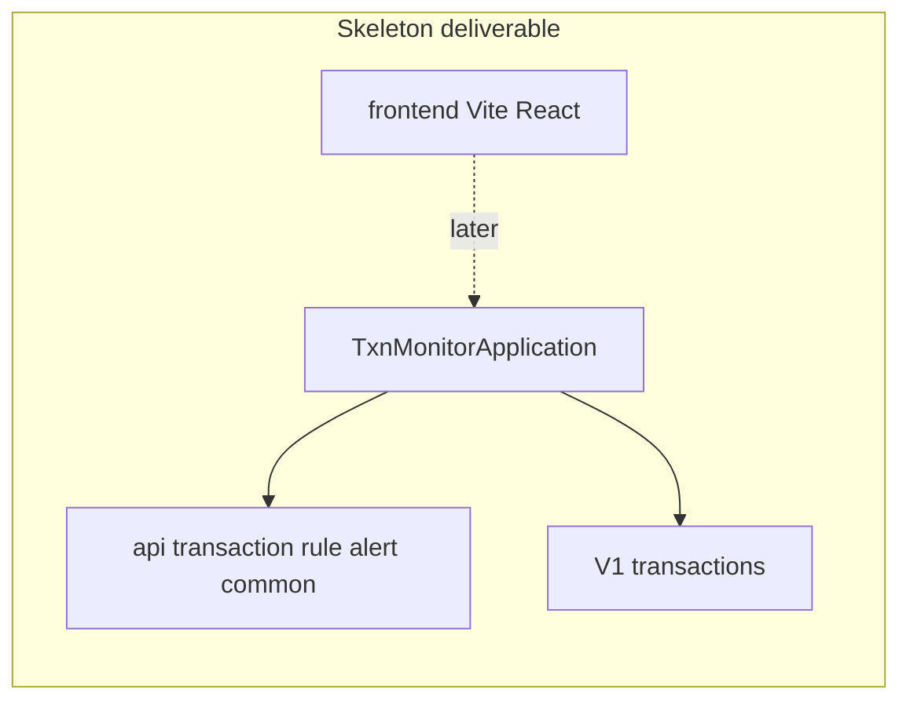

# Plan: Project skeleton (Phase 1 item 1)

Canonical copy for the team: [`.cursor/plans/001-project-skeleton.md`](.cursor/plans/001-project-skeleton.md) (create/overwrite that path when implementing; this Cursor plan is the same content).

## Goal

Ship a runnable empty shell that matches `backend-java.mdc` and the first Phase 1 milestone: Spring Boot app, package layout, Flyway configured, React under `frontend/`, and Flyway `V1` creating only the `transactions` table. **No** Transaction entity/repository, REST endpoints, rule engine, or alert tables yet (those are the next milestone checkboxes).

## Starting point (what exists today)

- Maven Spring Boot **3.4.4** app at repo root: [`pom.xml`](pom.xml), [`DemoApplication`](src/main/java/com/example/demo/DemoApplication.java), booking JDBC sample under `com.example.demo.*`
- MySQL via [`docker-compose.yml`](docker-compose.yml) (`coworking` DB); [`application-dev.properties`](src/main/resources/application-dev.properties) mentions Flyway but **Flyway is not on the classpath** and the stack is **Data JDBC**, not JPA
- **No** `frontend/` directory yet

## Locked decisions

| Decision | Choice |
|----------|--------|
| Base package | `com.example.txnmonitor` (fits `com.<team>.txnmonitor` + existing `com.example` groupId) |
| Persistence | Spring Data **JPA** + Flyway; `spring.jpa.hibernate.ddl-auto=validate` (never `update`) |
| DB | Keep MySQL 8 from docker-compose; rename database to `txnmonitor` |
| Artifact | Rename Maven `artifactId` / app name to `txnmonitor` |
| Frontend | Vite + React + TypeScript under `frontend/`; minimal placeholder UI only |
| Skeleton scope | Package dirs + app entry + config + `V1` migration + empty React shell; delete booking demo code |

## Target layout

```
com.example.txnmonitor
├── TxnMonitorApplication.java
├── api/            # empty for now (package-info.java)
├── transaction/
├── rule/
├── alert/
└── common/
```

```
src/main/resources/
├── application.properties
├── application-dev.properties
├── application-docker.properties
└── db/migration/
    └── V1__create_transactions.sql
frontend/                 # Vite React TS app
```

## Implementation steps

1. **Maven / Boot**
   - Update [`pom.xml`](pom.xml): `artifactId`/`name` → `txnmonitor`; replace `spring-boot-starter-data-jdbc` with `spring-boot-starter-data-jpa`; add `flyway-core` + `flyway-mysql` (Boot-managed versions); keep `mysql-connector-j` and web/test starters.
   - Move main class to `com.example.txnmonitor.TxnMonitorApplication`; delete all `com.example.demo` booking classes and tests.
   - Add `package-info.java` (or a trivial placeholder) under `api`, `transaction`, `rule`, `alert`, `common` so empty packages are tracked.
   - Replace smoke test with `TxnMonitorApplicationTests` (`@SpringBootTest` context loads — may need Testcontainers or H2 later; for skeleton, use `@SpringBootTest` only if MySQL is available, otherwise a minimal test that compiles and a note in README — **prefer**: add `test` profile with H2 + Flyway for CI-friendly context load).

2. **Config**
   - Set `spring.application.name=txnmonitor`, keep `server.port=8081`.
   - Datasource URL DB name → `txnmonitor`.
   - Explicit Flyway: enabled, locations `classpath:db/migration`, `baseline-on-migrate` as needed for existing local DBs.
   - `spring.jpa.hibernate.ddl-auto=validate`; disable SQL init scripts (`spring.sql.init.mode=never`).
   - Update [`docker-compose.yml`](docker-compose.yml): `MYSQL_DATABASE=txnmonitor`, JDBC URL accordingly.

3. **Flyway `V1__create_transactions.sql`** (columns per milestones + [DATABASE_DESIGN.md](docs/DATABASE_DESIGN.md))

```sql
CREATE TABLE transactions (
  transaction_id BIGINT AUTO_INCREMENT PRIMARY KEY,
  account_id     VARCHAR(64)  NOT NULL,
  payee_id       VARCHAR(64)  NOT NULL,
  amount         DECIMAL(15,2) NOT NULL,
  currency       VARCHAR(3)   NOT NULL,
  type           VARCHAR(30)  NOT NULL,
  timestamp      DATETIME     NOT NULL,
  description    VARCHAR(255) NULL,
  status         VARCHAR(20)  NOT NULL,
  CONSTRAINT chk_txn_amount_positive CHECK (amount > 0)
);
CREATE INDEX idx_txn_account_timestamp ON transactions (account_id, timestamp);
CREATE INDEX idx_txn_account_payee ON transactions (account_id, payee_id);
```

   Do **not** create `alerts` / `alert_transactions` in this migration.

4. **React `frontend/`**
   - Scaffold Vite React-TS (`npm create vite@latest frontend -- --template react-ts`).
   - Minimal App: title “Transaction Monitoring” placeholder; no API client screens yet.
   - Root README note: run API on `:8081`, UI via `npm run dev` (default Vite port).

5. **Docs / milestones (when implementing)**
   - Mark Phase 1 “Project skeleton” done in [`Project_milestones.md`](Project_milestones.md); set Current status.
   - Write this plan body to [`.cursor/plans/001-project-skeleton.md`](.cursor/plans/001-project-skeleton.md); leave [`sample-mvp-transaction-recording.md`](.cursor/plans/sample-mvp-transaction-recording.md) alone (still the next-feature example).

## Out of scope (next milestones)

- JPA `Transaction` entity + repository
- Controllers / DTOs / `POST|GET /transactions`
- Rule engine, alerts table migrations, React lists

## Verify when implemented

- `./mvnw -q test` (or `package`) succeeds
- With MySQL up: app starts and Flyway applies `V1`
- `frontend/` builds (`npm run build`)


