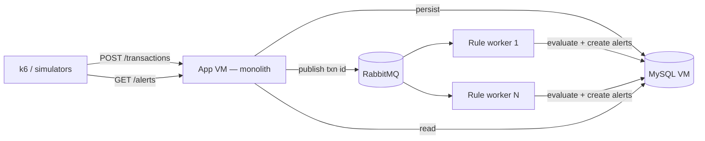

# 008 — Phase 3 Scale-out (Dedicated DB + Queue + Async Evaluation)

**Revised 06 Aug 2026:** Slices **3a** (prod compose overlay), **3b** (RabbitMQ + async eval + DLQ), **3d** (Caffeine cache), and internal `POST /internal/alerts` are implemented. **3c** (extracted worker JVM) and **3e** (read replica) remain.

Branch: `feature/phase3-scale-out` from `dev`  
Owner split: **B** (queue, workers, cache) · **A** (internal alert API, read replica, k6 re-run) · **C** (UI unchanged — verify alerts still appear)

## Goal

Remove JVM/DB compute contention and decouple ingest from rule evaluation so
the system sustains higher transaction volume without blocking HTTP threads.

Deliver in **incremental slices** — each slice is deployable and measurable
before the next starts.

## Problem (from load test)

On a single VM, Spring Boot and MySQL compete for CPU, RAM, and disk I/O.
Synchronous evaluate-on-record (`TransactionService.saveTransaction`) keeps
HTTP threads blocked while rules run DB lookups (Velocity, Daily Limit, New
Payee). Under burst load, both the JVM and InnoDB degrade together.

## Target architecture



Phase 3 **does not** split API / transaction / alert into separate
deployables. Only the **rule evaluation consumer** may become a second JVM
later. See `AGENTS.md` modular monolith rule.

## Rollout slices (do in order)

| Slice | What | Code change? | Proves |
|-------|------|--------------|--------|
| **3a** | MySQL on dedicated VM | Config only | Contention hypothesis |
| **3b** | Queue + in-process async consumer | Yes | Ingest throughput ↑, threads freed |
| **3c** | Extract rule worker JVM (optional demo) | Yes | Horizontal scale story |
| **3d** | Cache for velocity / daily-limit lookups | Yes | DB query load ↓ |
| **3e** | Read replica for KPI / list reads | Config + small code | Dashboard doesn't steal write I/O |

Stop and re-run k6 after **3a** and **3b** at minimum before starting 3c.

---

## Slice 3a — Dedicated MySQL VM (infra)

### Actions

1. Provision **DB VM** (same region/VPC as app VM). Suggested minimum: 2 vCPU,
   4 GB RAM (MySQL buffer pool ~50–70% of RAM).
2. Install MySQL 8; create `txnmonitor` DB; open port 3306 **only** from app
   VM private IP / security group.
3. Migrate data (if demo DB matters): `mysqldump` from old host → restore on
   DB VM, or accept fresh Flyway on empty DB for load tests.
4. Point app at remote DB:
   - Jenkins / compose env:  
     `DB_URL=jdbc:mysql://<DB_VM_IP>:3306/txnmonitor?useSSL=false&allowPublicKeyRetrieval=true&serverTimezone=UTC`
   - Tune Hikari on app VM: `maximum-pool-size=20` (start), watch connections
     on DB VM (`max_connections`).
5. **Remove MySQL from app VM compose** for production-like deploy (keep local
   `mysql` service in compose for dev laptops).

### Files / docs to touch

- `docker-compose.yml` — optional `docker-compose.prod.yml` overlay without
  `mysql` service; app uses `DB_URL` env.
- `README.md`, `docs/MVP_STATUS.md` — two-VM topology note.
- Jenkins: inject `DB_URL`, `DB_USER`, `DB_PASS` from credentials store (not
  git).

### Success criteria

- Same functional E2E (seed → alert in UI).
- k6 `post-only` sustained RPS **higher than single-VM baseline** at same
  error rate, **before** any queue code ships.

---

## Slice 3b — Queue + async evaluation (monolith)

### Queue choice: **RabbitMQ**

| Option | Pros | Cons |
|--------|------|------|
| **RabbitMQ** ✓ | Spring AMQP first-class; durable queues; easy local compose | Extra container |
| Redis Streams | Fewer moving parts if Redis already present | Less natural Spring story; ops familiarity |
| Kafka | High throughput | Overkill for demo; heavier ops |

Run RabbitMQ on **app VM** initially (low latency to publisher + consumers).
Can move to its own small VM later if needed.

### Message contract

Keep payloads small and DB as source of truth:

```json
{
  "transactionId": 12345,
  "publishedAt": "2026-08-06T08:00:00Z"
}
```

- Queue name: `txn.evaluation`
- Routing: direct exchange `txn.events`, routing key `evaluation.requested`
- Publisher fires **after** successful `transactionRepository.save()` (same
  DB transaction boundary: use `@TransactionalEventListener(phase = AFTER_COMMIT)`
  or explicit publish after commit).
- Consumer loads `Transaction` by id → `TransactionSnapshot` →
  `ruleEngine.evaluate()` → `alertService.createFromMatches()`.

Do **not** put full transaction JSON on the queue unless needed for cross-DB
workers without DB access (not our case).

### Evaluation mode flag

Support rollback and A/B during QA:

```properties
# application.properties
txnmonitor.evaluation.mode=async   # sync | async
```

- `sync`: current behaviour (evaluate inline in `TransactionService`).
- `async`: save + publish only; consumer evaluates.

Default `async` in `docker` profile once tests pass; keep `sync` for unit tests.

### New types / classes (package layout)

```
com.example.txnmonitor.transaction
  TransactionEvaluationPublisher      # interface
  RabbitTransactionEvaluationPublisher
  TransactionEvaluationRequested      # event DTO

com.example.txnmonitor.rule
  TransactionEvaluationConsumer       # @RabbitListener
  TransactionEvaluationService        # load txn, evaluate, alert (shared by sync path too)

com.example.txnmonitor.common.config
  RabbitMqConfig                      # queue, exchange, binding, JSON converter
```

Refactor `TransactionService.saveTransaction()`:

```java
// async path (sketch)
Transaction saved = transactionRepository.save(toEntity(request));
evaluationPublisher.publish(saved.getTransactionId());
return toResponse(saved);

// sync path delegates to TransactionEvaluationService.evaluate(saved)
```

Extract evaluate+alert from `TransactionService` into
`TransactionEvaluationService` so sync, async consumer, and future HTTP worker
share one code path.

### Idempotency (at-least-once delivery)

RabbitMQ may redeliver. Avoid duplicate OPEN alerts for the same txn+rule:

- **Preferred:** before `createFromMatches`, check
  `alertTransactionRepository.existsByTransactionIdAndRuleType(...)` or query
  open alert for `(account_id, rule_type, transaction_id link)`.
- **Stretch:** DB unique index on `(transaction_id, rule_type)` via
  `alert_transactions` + migration — only if dedup logic in service is
  insufficient.

### Dependencies

Add to `pom.xml`:

```xml
<dependency>
  <groupId>org.springframework.boot</groupId>
  <artifactId>spring-boot-starter-amqp</artifactId>
</dependency>
```

### Docker compose

Add service:

```yaml
rabbitmq:
  image: rabbitmq:3-management
  ports:
    - "5672:5672"
    - "15672:15672"   # management UI — dev only
  networks:
    - springboot-network
```

App env: `SPRING_RABBITMQ_HOST=rabbitmq`, etc.

### Internal alert endpoint (prep for 3c, optional in 3b)

Not required while consumer runs in-process (`AlertService` direct call).
Add when extracting worker:

| Method | Path | Body | Notes |
|--------|------|------|-------|
| POST | `/internal/alerts` | `{ transactionId, matches: RuleMatch[] }` | Not in Swagger; no auth in MVP but bind to internal network only |

Shape mirrors `AlertService.createFromMatches` inputs. Stable contract per
`backend-java.mdc`. Monolith implements controller → delegates to
`AlertService`.

### Tests (TDD order)

1. `TransactionEvaluationServiceTest` — evaluate+alert with mocked deps
   (move logic out of `TransactionServiceTest`).
2. `RabbitTransactionEvaluationPublisherTest` — verify message published after
   save (mock `RabbitTemplate` or Testcontainers RabbitMQ).
3. `TransactionEvaluationConsumerTest` — message in → evaluate called once.
4. `TransactionServiceTest` — async mode: save called, publish called,
   **ruleEngine not called** in service.
5. Integration: `@SpringBootTest` + Testcontainers (MySQL + RabbitMQ) —
   POST txn → poll `GET /alerts` until alert appears (measure MTTD).

Do not modify `Rule`, `RuleEngine`, or existing rule classes.

### Success criteria

- k6 ingest RPS ↑ vs 3a baseline; p95 `POST /transactions` latency ↓ (no
  rule work on HTTP thread).
- MTTD p95 (time from POST to alert visible on `GET /alerts`) documented —
  expect low seconds under normal load, worse under extreme backlog (honest
  Phase 3 story).
- No duplicate alerts on forced consumer retry (idempotency test).

---

## Slice 3c — Extract rule engine worker (demo / stretch)

Only after 3b is stable.

1. New Spring Boot module or `rule-worker/` subproject — same `rule` +
   `transaction` (read) + HTTP client to monolith packages, **or** copy-minimal
   worker that only hosts `TransactionEvaluationConsumer` + `RuleEngine`.
2. Worker consumes from same queue; **does not** embed `AlertService` — calls
   `POST /internal/alerts` on monolith.
3. Scale demo: `docker compose up --scale rule-worker=2`.
4. Monolith publisher unchanged.

Keep worker thin: load txn from DB (shared MySQL VM), evaluate, POST matches.

---

## Slice 3d — Cache for count/sum lookups

`RepositoryRuleEvaluationContext` hits DB on every evaluation for Velocity,
New Payee, Daily Limit. Under load, same accounts generate repeated queries.

1. Introduce `CachingRuleEvaluationContext` decorator (or Caffeine-backed
   implementation of `RuleEvaluationContext`).
2. Cache keys examples:
   - `velocity:{accountId}:{windowStart}` — TTL = window length
   - `daily:{accountId}:{date}` — invalidate/increment on new DEBIT for account
3. Property: `txnmonitor.rule-evaluation.cache.enabled=true`
4. Unit tests: cache hit avoids second repository call (mock repo + verify
   invocation count).

**Order note:** cache helps most **after** async workers increase parallel
evaluation. Can ship in 3b if time is short, but measure before/after.

---

## Slice 3e — Read replica (reporting)

1. MySQL replica on same or second DB VM; async replication from primary.
2. Route **read-only** paths to replica via second datasource:
   - `GET /transactions`, `GET /alerts`, KPI/dashboard aggregations
3. Keep **writes + evaluation lookups** on primary (replica lag would break
   velocity/new-payee correctness if reads lag).
4. Spring: `@Transactional(readOnly = true)` + routing datasource or separate
   `TransactionRepository` qualifier — keep scope minimal.

Defer until ingest path is healthy; fixes operator UI contention, not ingest.

---

## MTTD measurement (k6 / scripts)

Add to load-test write-up (`docs/load-test-results.md` when shreya lands it):

| Metric | How |
|--------|-----|
| Ingest throughput | k6 `post-only` — RPS, p95 latency, error % |
| MTTD async | Custom k6 scenario: POST → loop `GET /alerts?accountId=` until new alert or timeout; record elapsed |
| Queue depth | RabbitMQ management API / Actuator if exposed |
| DB VM | CPU, RAM, disk I/O, `Threads_running`, slow query log |

Document **sync baseline vs 3a vs 3b** in one table for presentation.

---

## Configuration summary

| Property | Dev | Docker / VM |
|----------|-----|-------------|
| `DB_URL` | `localhost:3306` | `jdbc:mysql://<DB_VM>:3306/txnmonitor?...` |
| `txnmonitor.evaluation.mode` | `sync` or `async` | `async` |
| `spring.rabbitmq.host` | `localhost` | `rabbitmq` |
| Hikari pool | 10 | 20 (tune) |

---

## Team tasks (aligned with `docs/TEAM_WORK_SPLIT.md`)

| Person | Tasks |
|--------|-------|
| **B (sathwik)** | 3a DB VM with ops; RabbitMQ compose; publisher/consumer; optional worker extract; cache |
| **A (shreya)** | Internal alert API; read replica wiring; k6 re-run + results doc; keep public APIs stable |
| **C (Rameez)** | Smoke UI after deploy; no frontend changes expected — alerts may appear slightly later |

---

## File checklist (3b core)

| File | Change |
|------|--------|
| `pom.xml` | `spring-boot-starter-amqp` |
| `docker-compose.yml` | `rabbitmq` service; app depends_on + env |
| `application.properties` | evaluation mode, rabbitmq defaults |
| `application-docker.properties` | async mode, rabbit host |
| `TransactionService.java` | branch sync/async; delegate evaluate |
| `TransactionEvaluationService.java` | **new** — shared evaluate path |
| `TransactionEvaluationPublisher.java` | **new** |
| `RabbitTransactionEvaluationPublisher.java` | **new** |
| `TransactionEvaluationConsumer.java` | **new** |
| `RabbitMqConfig.java` | **new** |
| `AlertService.java` | optional dedup guard |
| `*Test.java` | as listed above |
| `Project_milestones.md` | check off Phase 3 items as slices land |

---

## Out of scope (this plan)

- Kafka, service mesh, multiple app deployables for API/alert/transaction
- Changing `Rule` / `RuleEngine` interface
- UI polling / websockets for “instant” alert display (operator refreshes list)
- Full auth on `/internal/*` (network isolation only for MVP)
- Machine learning / new rule types

---

## Open questions

1. **Second app VM?** If one app VM still CPU-saturated after 3a+3b, add an app
   VM for API+monolith and keep RabbitMQ co-located — before splitting workers.
2. **Queue on DB VM?** No — keeps DB I/O clean; queue lives with app tier.
3. **Exactly-once?** Not required; idempotent alert creation is enough.
4. **Dead letter queue?** Add `txn.evaluation.dlq` + log alert if consumer throws
   after retries — good demo resilience story, small effort in `RabbitMqConfig`.

---

## Presentation one-liner

> “We moved MySQL off the app box to stop CPU contention, then decoupled ingest
> from evaluation with a queue so POST stays fast and rule workers scale
> horizontally — MTTD is now seconds under load instead of blocking every
> ingest thread.”
