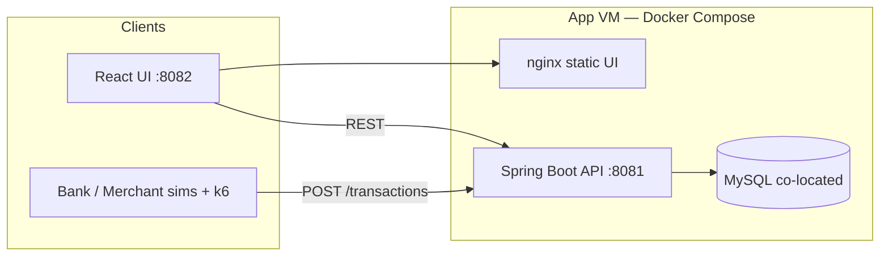
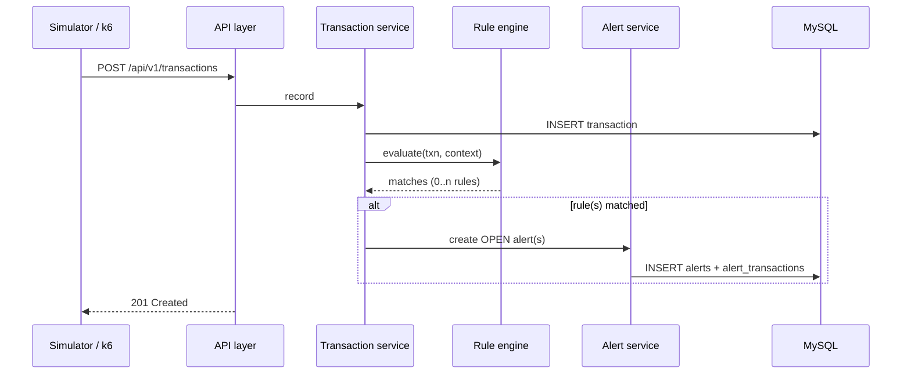

# Final Presentation — Transaction Monitoring & Alerts

**Team:** Agilish — shreya · sathwik · Rameez  
**Branch / source of truth:** `dev`  
**Duration:** **10 minutes** (+ questions)  
**Date context:** August 2026 · Sprint 2 wrap

**Deck:** [`FINAL-PRESENTATION.pptx`](FINAL-PRESENTATION.pptx) (6 slides, HSBC-style)  
Rebuild it with `.pptx-venv/bin/python scripts/build_final_pptx.py`; preview
without PowerPoint via `scripts/preview_pptx.py`.  
**Companion docs:** [`docs/load-test-results.md`](docs/load-test-results.md) · [`docs/PRESENTATION_SCRIPT.md`](docs/PRESENTATION_SCRIPT.md) · [`Project_milestones.md`](Project_milestones.md)

---

## The story in one line

Banks and merchants push payments all day. We built a system that **detects risk the moment a transaction lands**, gives an operator a clear path to investigate, and we **measured what breaks when the volume stays high** — then learned why “just put the DB on another VM” wasn’t as simple as it sounded.

---

## Timing (strict 10:00)

| # | Beat | Who (suggested) | Time |
|---|------|-----------------|------|
| 1 | Team + the problem | All (brief intros) | **0:45** |
| 2 | What we built (overview) | One speaker | **1:15** |
| 3 | Architecture on `dev` | Backend owner | **2:30** |
| 4 | Live demo (tight) | Frontend owner | **2:00** |
| 5 | Performance testing + graphs | QA owner | **2:00** |
| 6 | Challenge: separate DB VM / firewall | Ops/backend | **1:00** |
| 7 | Agile how we worked + next + thank you | All | **0:30** |
| | **Total** | | **~10:00** |

> If demos lag, cut the live walk to dashboard → one alert lifecycle only. Keep the load graphs — they are the “middle of the story.”

---

## 1. Beginning — Who we are & what we were asked to do (~0:45)

### Team

| Person | Focus on this project |
|--------|------------------------|
| **shreya** | Transactions API, seed/Swagger, KPIs, **k6 load tests**, alert/traffic simulator |
| **sathwik** | Rule engine + alerts, pagination/`afterId`, Docker/deploy, **queue + DB separation** (Phase 3) |
| **Rameez** | Operator UI — Dark Obsidian theme, dashboard graphs, rules UX, filters, virtual scroll |

### The brief (say this out loud)

> We were asked to build a **Transaction Monitoring & Alerts Dashboard**: ingest simulated bank and merchant traffic, evaluate transactions against rules, and manage alerts through a full lifecycle — for a **single operator**, no heavy auth product.  
> We worked in **short sprints** over the program (MVP first, then richer rules and operator UX, then scale evidence).

**Learning arc:** modular Spring Boot, React operator UI, TDD on rules/lifecycle, Flyway schema, and proving the system under load — not just “it works on my laptop.”

---

## 2. Middle (part A) — Product overview (~1:15)

### The operator loop

```text
  Simulate / ingest txn  →  Rules fire (sync)  →  OPEN alert
        ↑                                            ↓
   Dashboard KPIs              ACK → INVESTIGATE → CLOSE / DISMISS
```

### What shipped on `dev`

| Layer | Delivered |
|-------|-----------|
| **Ingest** | `POST/GET /transactions` — soft tenancy via `sourceType` / `sourceId` / `sourceName` |
| **Detection** | Four rules: Amount Threshold, Velocity, New Payee, Daily Limit (configurable) |
| **Alerts** | Lifecycle with validated transitions; failing reason; severity; multi-rule matches |
| **UI** | Dashboard (KPIs + graphs), transactions (pagination + `afterId` delta), alerts (virtual scroll, filter/sort), rules view/edit |
| **Evidence** | k6 Pass 1–3 + EXPLAIN index proof documented |

**Out of scope (on purpose):** ML anomaly detection, hard tenancy per bank, live bank network hooks.

---

## 3. Middle (part B) — Architecture on `dev` (~2:30)

### Design decision: modular monolith

One Spring Boot deployable. Clean packages — **not** microservices yet. The **rule engine** is behind a `Rule` / `RuleEngine` interface so extracting it later is a deployment change, not a rewrite.



### Request path (detect in the same request)



### Data model (decisions worth saying)

| Decision | Why |
|----------|-----|
| **Soft tenancy** — `source_*` on every row | One DB; banks + merchants share schema |
| **No Account / Payee master tables** | Opaque IDs + display names on the txn; rules query those columns |
| **`alert_transactions` junction** | One txn can drive one or many linked alerts; velocity can attach multiple txns later |
| **KPIs are aggregations** | Not stored columns — dashboard queries / API |
| **Versioned migrations checked in** | `V1`–`V5` under `db/migration` |

**Core tables:** `transactions` · `alerts` · `alert_transactions` · `rule_configs`

> **Careful if asked about migrations:** the `V1`–`V6` Flyway scripts are the
> reviewed schema and Flyway runs in the test profile, but
> `application.properties` currently ships `spring.flyway.enabled=false` with
> `ddl-auto=update`. Say that honestly — flipping Flyway on at runtime is a
> known tidy-up, not a claim to make on stage. Default rule rows are ensured at
> startup by `RuleConfigSeeder` when the table is empty.

### Package layout (`dev`)

```text
com.example.txnmonitor
  api/           controllers + DTOs
  transaction/   record + query
  rule/          Rule, RuleEngine, four rule types
  alert/         lifecycle + transitions
  common/        shared config / exceptions
```

Frontend: typed API clients per module; local state; Dark Obsidian operator shell.

---

## 4. Live demo (~2:00) — keep it short

**Pre-open:** UI on the VM (`:8082`), API healthy (`:8081`).

1. **Dashboard** — KPIs + graphs by type / status / severity / rule.  
2. **Transactions** — filter by source; show pagination / live feel (`afterId`).  
3. **Alerts** — open one with **failing reason** + severity; walk **OPEN → ACK → INVESTIGATE → CLOSE**.  
4. **Rules** (optional if time) — show editable thresholds + short explanation.

*(Skip anything not in the product — e.g. no “Mark suspicious.”)*

---

## 5. Middle (part C) — Performance testing (~2:00)

**Setup:** k6 from **Windows VM** → Linux app at `http://10.9.69.3:8081`  
**Deploy:** Docker Compose — **JVM + MySQL on the same box** (~2 vCPU / 3.7 GiB)

### Headline numbers

| Pass | Scenario | Approx RPS | p95 | Fail rate |
|------|----------|------------|-----|-----------|
| **1** | Write-only ramp → 200 VU | **234** | **763 ms** | **0%** |
| **2** | Mixed 80/20 read/write → 150 VU | **242** | **623 ms** | **0%** |
| **3** | Soak 140 VU × 10 min | **214** | **1.13 s** | **0.09%** |

Short ramps looked healthy. **Soak** is where the story gets interesting.

### Graph — latency across passes

```text
p95 latency (ms)
1200 |                              ████  Pass 3 soak (1130)
1000 |
 800 |  ████ Pass 1 (763)
 600 |              ████ Pass 2 (623)
 400 |
 200 |
   0 +----------------------------------------
         Write ramp     Mixed      Soak 10m
```

### Graph — throughput vs stress

```text
approx RPS
250 |  ████ 234        ████ 242
200 |                           ████ 214  ← sustained, but costlier
150 |
100 |
  0 +----------------------------------------
         Pass 1         Pass 2      Pass 3
```

### Graph — rule.evaluate mean (Actuator) under soak

```text
mean rule.evaluate (ms)
140 |                         ████ ~126  end soak
120 |
100 |              ████ ~91 mid soak
 80 |
 60 |  ████ ~53–57 after Pass 1–2
 40 |
  0 +----------------------------------------
       After P1/P2    Mid soak    End soak
```

**Talk track:** On Pass 1–2, p95 was 600–800 ms while rule mean stayed ~50–60 ms → most latency was **outside** the rule timer (DB write, pool, network, alert inserts). Under soak, **both** rose → shared-box contention (JVM fighting `mysqld` for CPU/RAM), **not** missing indexes.

### Indexes — we checked, they are used

| Query pattern | Index (`EXPLAIN`) |
|---------------|-------------------|
| account + time window (velocity-style) | `idx_txn_account_timestamp` |
| account + payee (new-payee-style) | `idx_txn_account_payee` |
| source + time ORDER BY | `idx_txn_source_timestamp` |

**Conclusion we want the room to remember:**  
> Indexes are fine. The bottleneck under sustained load is **co-locating the app and MySQL**. Next lever: separate DB host + async queue between ingest and evaluate — then re-run Pass 3.

Full raw k6 / InnoDB notes: [`docs/load-test-results.md`](docs/load-test-results.md).

---

## 6. Challenge — “Put MySQL on another VM” (~1:00)

### What we planned

After soak showed co-location pain, Phase 3 plan was:

1. Move MySQL to a **second VM**  
2. Add a **queue** between record and rule evaluation  
3. Re-run the 140 VU soak to prove the win

### What blocked us

We could not reliably connect **Linux app VM → Linux DB/app peer** the way we could from Windows.

| Source | Target (Linux `:8081` / listener) | Result |
|--------|-----------------------------------|--------|
| **Windows VM** | Linux VM | Works (`curl`, `nc`) |
| **Linux VM A** | Linux VM B | Does **not** work |
| `nc` listen on Linux B ← Windows | | Works |
| `nc` listen on Linux B ← Linux A | | Fails the same way |

**Inference:** not a Spring/Docker bug — plain TCP (`nc`) fails Linux→Linux. Most likely **security group / firewall / routing** between Linux VMs in the lab environment.

**Honest lesson for the room:**  
> We diagnosed with evidence (same port, Windows vs Linux, `curl` + `nc`). We didn’t ship the split-DB topology in time, but we know *why* and what we’d unblock first with instructors/infra.

---

## 7. Ending — How we worked (agile) + what’s next (~0:30)

### Agile practices we actually used

| Practice | How it showed up |
|----------|------------------|
| **MVP-first build order** | Transactions → Amount Threshold sync → alerts lifecycle → UI — Phase 2 rules only after E2E worked |
| **Role split + shared contracts** | A / B / C ownership with clear hand-offs (API shapes before UI invents them) |
| **Kanban + milestones** | Live board + `Project_milestones.md` as the honest status source |
| **TDD where it mattered** | Rule trigger/boundary tests; illegal alert transitions |
| **Short plans before big features** | `.cursor/plans/` for pagination, multi-rule, UX work |
| **Stand-ups / retros / client notes** | Captured in `docs/STANDUP_LOG.md`, `SPRINT_RETROSPECTIVE.md`, `MEETING_NOTES.md` |
| **Evidence over vibes** | k6 + EXPLAIN + Actuator metrics before claiming “scale” |

### If we had more time

1. Unblock **Linux↔Linux** networking → MySQL on its own VM  
2. **Async queue** + extract rule workers  
3. Re-run **Pass 3 soak** and show the before/after graph  
4. Finish alert simulator polish + final unit-test sweep  
5. Phase 4 hardening (TLS, masking, secrets out of source)

### Close

> Thank you for listening — happy to take questions on architecture, the k6 numbers, or the firewall finding.

---

## Deck map — what is on each of the 6 slides

| # | Slide | Talk-track section | Who |
|---|-------|--------------------|-----|
| 1 | Title — **Agilish**, project, operator loop | §1 Team + problem | All |
| 2 | *Payments do not wait for a night-time batch* — problem, what shipped, headline numbers (4 rules / 5 states / 14 endpoints / 89 tests) | §1–2 | One speaker |
| 3 | **Architecture diagram** — clients → app VM (nginx, Spring Boot, 4 packages) → MySQL, plus the 5-step synchronous detection path | §3 | Backend owner |
| 4 | Detection & lifecycle — the 4 rules with defaults, the state machine, how we tested | §3 (cont.) | Backend owner |
| 5 | Evidence — 3 k6 passes, p95 and `rule.evaluate` charts, the firewall blocker | §5–6 | QA / Ops |
| 6 | Agile with receipts + what's next + thank you | §7 | All |

**Live demo (§4) sits between slides 4 and 5** — share the screen, then come
back to slide 5 for the numbers.

---

## Backup Q&A (30–60 s answers)

| Question | Answer |
|----------|--------|
| Why not microservices from day one? | Packages first; extract **rule engine** when load demands it. |
| Soft tenancy? | One DB; every row carries `sourceType` / `sourceId` / `sourceName`. |
| Auth? | Single-operator assumption; login gate is stretch, not multi-user IAM. |
| Is sync evaluate a mistake? | Right for MVP MTTD; Phase 3 makes evaluate async **after** we have evidence. |
| Where are the load numbers? | `docs/load-test-results.md` on the repo. |
| Linux can’t reach Linux — app bug? | No — `nc` fails the same way; treat as SG/firewall. |

---

## Questions for other teams (we must ask)

Pick one when the previous group (or last group, if we go first) finishes:

1. How did you decide what belongs in the **first** deployable vs what you deferred?  
2. Did you load-test, and what was the first bottleneck you actually measured?  
3. How did you split work so frontend wasn’t inventing APIs ahead of backend?  
4. What would you undo if you restarted the project tomorrow?

---

*Keep cameras on. Everyone speaks. Do not overrun — end at “any questions?” with ~30 s buffer.*
