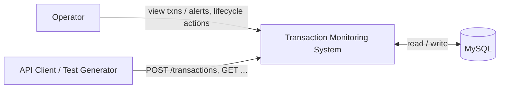
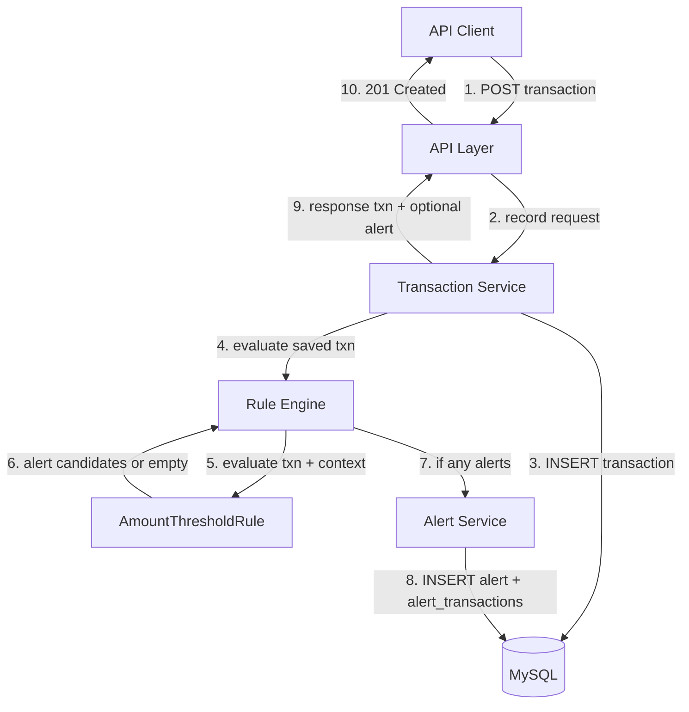
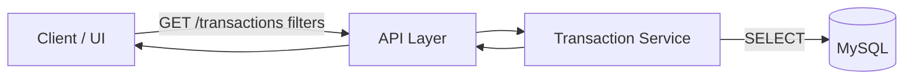
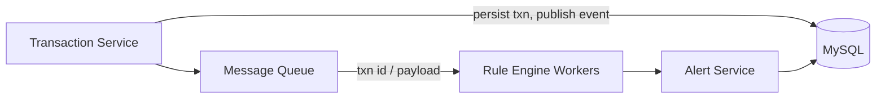

# Data Flow Diagram — MVP Transaction Monitoring

## Short answer

**Yes.** In MVP, **every** successfully recorded transaction is passed to the
rule engine **synchronously** (same request, no queue). The engine runs all
active rules (today: Amount Threshold only). If a rule fires, an alert is
created and linked to that transaction before the API responds.

Phase 3 changes *when* evaluation happens (via a queue), not *whether* each
transaction is evaluated.

---

## Level 0 — Context

External actors talk to one system; the database is the sink/source of
persisted state.

---

## Level 1 — Record transaction & evaluate rules (happy path)

This is the path that answers “does each transaction go through the rule
engine?”

### Data stores (logical)

| Store | Written on this path | Read on this path |
|-------|----------------------|-------------------|
| `transactions` | Every POST | Later GETs; Phase 2 rules also read for velocity/payee/limits |
| `alerts` | Only if a rule fires | Operator GET / lifecycle |
| `alert_transactions` | Only if a rule fires | Alert detail |

### Important behaviors

| Case | Rule engine called? | Alert created? |
|------|---------------------|----------------|
| Amount above threshold | Yes | Yes (`OPEN`) |
| Amount at/below threshold | Yes | No |
| Validation failure (bad payload) | No — never persisted | No |
| Persist fails | No evaluation | No |

So: **every persisted transaction** is evaluated; not every HTTP request.

---

## Level 1 — Operator alert lifecycle (separate flow)

Alerts are created by the engine; the operator moves them through status
via the alert service (not the rule engine).

---

## Level 1 — Query transactions (no rule engine)

List/search does **not** re-run the rule engine.

---

## Phase 3 contrast (not MVP)

When the queue is introduced, each transaction is still evaluated, but
asynchronously:

MVP deliberately skips the queue so demos stay simple: POST → maybe alert
in the same response (or immediately visible on `GET /alerts`).

---

## Module mapping

| DFD process | Package |
|-------------|---------|
| API Layer | `com.example.txnmonitor.api` |
| Transaction Service | `com.example.txnmonitor.transaction` |
| Rule Engine + rules | `com.example.txnmonitor.rule` |
| Alert Service | `com.example.txnmonitor.alert` |
| MySQL | Flyway schema — see [`DATABASE_DESIGN.md`](./DATABASE_DESIGN.md) |

---

*Aligned with `AGENTS.md`, `rule-engine.mdc`, and Phase 1 of `Project_milestones.md`.*
