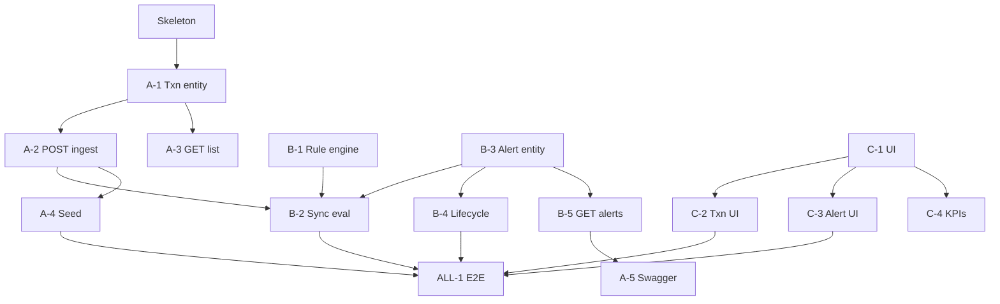

# Kanban Board — Transaction Monitoring & Alerts

**Update this file daily.** Move cards between columns as work progresses.  
Commit message when updating: `chore: kanban update [date]`  
**Milestones:** [`Project_milestones.md`](../Project_milestones.md) · **Stand-ups:** [`STANDUP_LOG.md`](./STANDUP_LOG.md) · **Stories:** [`STORYLINE_AND_KANBAN.md`](./STORYLINE_AND_KANBAN.md) · **User stories (TMD):** [`USER_STORIES.md`](./USER_STORIES.md) · **Meetings:** [`MEETING_NOTES.md`](./MEETING_NOTES.md) · **Presentation:** [`MVP_PRESENTATION.md`](./MVP_PRESENTATION.md)

---

## Board — Sprint 2 (05–11 August 2026)

### ✅ DONE
| Story | Owner | Notes |
|-------|-------|-------|
| Skeleton (Spring Boot + Flyway + React placeholder) | ALL | |
| ER diagram + database design docs | Rameez + shreya | |
| DFD, storyline, team split docs | sathwik | |
| [C-1] AGIL-ish Dark Obsidian UI shell + left nav routing | sathwik | |
| [C-2] Transaction list UI (filter by source) | sathwik | Live API only |
| [C-3] Alert list + detail + lifecycle actions UI | sathwik | Live API only |
| [C-4] KPI strip | sathwik | `GET /api/v1/dashboard` |
| [A-1] Transaction entity + repository | shreya | Merged on `dev` |
| [A-2] POST /transactions ingest | sathwik | + sync rule eval wiring |
| [A-3] GET /transactions + filters | sathwik | Envelope + `transactionType` |
| [A-4] Seed BANK/MERCHANT script | sathwik | `scripts/seed-demo.sh` |
| [A-5] Swagger / OpenAPI | sathwik | `/swagger-ui.html` |
| [B-1] Rule + RuleEngine + AmountThresholdRule | sathwik | Threshold 10000, strict `>` |
| [B-2] Wire record → sync rule evaluate | sathwik | |
| [B-3] Alert entity + alert_transactions | sathwik | Flyway V2 |
| [B-4] Alert lifecycle endpoints | sathwik | Validated transitions |
| [B-5] GET /alerts + GET /alerts/{id} | sathwik | |
| [ALL-1] E2E MVP path (seed → alert → close) | ALL | Software ready |
| [B-6] VelocityRule (Phase 2) | sathwik | N txns within T mins |
| [B-7] NewPayeeRule (Phase 2) | sathwik | First txn to unseen payee |
| [B-8] DailyLimitRule (Phase 2) | sathwik | Cumulative daily amount |
| [C-5] Frontend flat restyle | sathwik | Dark Obsidian tokens, status dots, mono cells |
| [C-6] Search bar + pause feed button | Rameez | PR #2 merged |
| [T-1] Fix AmountThresholdRuleTest after merge | Rameez | Post-merge cleanup |
| [T-2] Improve rule test coverage + doc workflow | Rameez | Coverage docs added |
| Docker/nginx deployment | sathwik | compose on port 80, PR #1 |
| Jenkins CI update | sathwik | Neueda repo |

---

### 🔁 REVIEW
| Story | Owner | Branch | PR |
|-------|-------|--------|----|
| *(none)* | | | |

---

### 🚧 IN PROGRESS
| Story | Owner | Branch | Started |
|-------|-------|--------|---------|
| [QA-1] End-to-end + rule testing | shreya | dev | 05 Aug |
| Login page + superadmin user | sathwik | dev | 05 Aug |

---

### 🟢 READY
| Story | Owner | Depends on |
|-------|-------|------------|
| Severity levels (HIGH/MEDIUM/LOW) in UI | Rameez | Phase 2 rules done |
| Rules table + config UI | sathwik + Rameez | Phase 2 rules done |

---

### 🔵 BACKLOG
| Story | Owner | Notes |
|-------|-------|-------|
| Queue + extract rule engine | sathwik + shreya | Phase 3 |
| TLS / masking / audit hardening | ALL | Phase 4 |

---

## Dependency map (Phase 1 — complete)

---

## WIP rules
- **Limit: 1 card In Progress per person** at a time.
- Card moves to **Review** when a PR is opened (not when you think it's done).
- Card moves to **Done** when the PR is merged AND the milestone checkbox is ticked in `Project_milestones.md`.
- PR title must include the story ID: `A-2: POST transactions ingest`.

---

## Phase 2+ parking lot

| Phase | Stories |
|-------|---------|
| 2 | ~~VelocityRule~~, ~~NewPayeeRule~~, ~~DailyLimitRule~~; rules table + config UI; severity colors |
| 3 | Message queue; extract rule engine; cache; read replica |
| 4 | TLS; DB encryption; field masking; full audit trail |

---

*Last updated: 05 August 2026 — Phase 2 rules complete; testing + login in progress*
