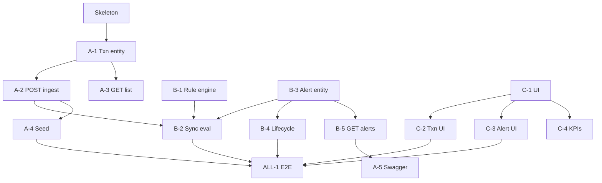

# Kanban Board — Transaction Monitoring & Alerts

**Update this file daily.** Move cards between columns as work progresses.  
Commit message when updating: `chore: kanban update [date]`  
**Milestones:** [`Project_milestones.md`](../Project_milestones.md) · **Stand-ups:** [`STANDUP_LOG.md`](./STANDUP_LOG.md) · **Stories:** [`STORYLINE_AND_KANBAN.md`](./STORYLINE_AND_KANBAN.md) · **Presentation:** [`MVP_PRESENTATION.md`](./MVP_PRESENTATION.md)

---

## Board — Sprint 2 (05–11 August 2026)

### ✅ DONE
| Story | Owner | Notes |
|-------|-------|-------|
| Skeleton (Spring Boot + Flyway + React placeholder) | ALL | |
| ER diagram + database design docs | Rameez + shreya | |
| DFD, storyline, team split docs | IamUsike | |
| [C-1] AGIL-ish Dark Obsidian UI shell + left nav routing | C | |
| [C-2] Transaction list UI (filter by source) | C | Live API only |
| [C-3] Alert list + detail + lifecycle actions UI | C | Live API only |
| [C-4] KPI strip | C | `GET /api/v1/dashboard` |
| [A-1] Transaction entity + repository | A | Merged on `dev` |
| [A-2] POST /transactions ingest | A | + sync rule eval wiring |
| [A-3] GET /transactions + filters | A | Envelope + `transactionType` |
| [A-4] Seed BANK/MERCHANT script | A | `scripts/seed-demo.sh` |
| [A-5] Swagger / OpenAPI | A | `/swagger-ui.html` |
| [B-1] Rule + RuleEngine + AmountThresholdRule | B | Threshold 10000, strict `>` |
| [B-2] Wire record → sync rule evaluate | B | |
| [B-3] Alert entity + alert_transactions | B | Flyway V2 |
| [B-4] Alert lifecycle endpoints | B | Validated transitions |
| [B-5] GET /alerts + GET /alerts/{id} | B | |
| [ALL-1] E2E MVP path (seed → alert → close) | ALL | Software ready; room dry-run = presentation |

---

### 🔁 REVIEW
| Story | Owner | Branch | PR |
|-------|-------|--------|----|
| *(none)* | | | |

---

### 🚧 IN PROGRESS
| Story | Owner | Branch | Started |
|-------|-------|--------|---------|
| *(none — Phase 1 complete)* | | | |

---

### 🟢 READY (Phase 2 — do not start until after presentation dry-run)
| Story | Owner | Depends on |
|-------|-------|------------|
| VelocityRule | B | ALL-1 presented |
| NewPayeeRule | B | ALL-1 presented |
| DailyLimitRule | B | ALL-1 presented |

---

### 🔵 BACKLOG
| Story | Owner | Notes |
|-------|-------|-------|
| Rules table + config UI | B + C | Phase 2 |
| Queue + extract rule engine | B + A | Phase 3 |
| TLS / masking / audit hardening | ALL | Phase 4 |

---

## Dependency map (Phase 1 — complete)

---

## WIP rules
- **Limit: 1 card In Progress per person** at a time.
- Card moves to **Review** when a PR is opened (not when you think it's done).
- Card moves to **Done** when the PR is merged AND the milestone checkbox is ticked in `Project_milestones.md`.
- PR title must include the story ID: `A-2: POST transactions ingest`.

---

## Phase 2+ parking lot
*(Presentation / dry-run first; then pick these up)*

| Phase | Stories |
|-------|---------|
| 2 | VelocityRule, NewPayeeRule, DailyLimitRule; rules table + config UI; severity colors |
| 3 | Message queue; extract rule engine; cache; read replica |
| 4 | TLS; DB encryption; field masking; full audit trail |

---

*Last updated: 04 August 2026 — Phase 1 MVP demo-ready*
