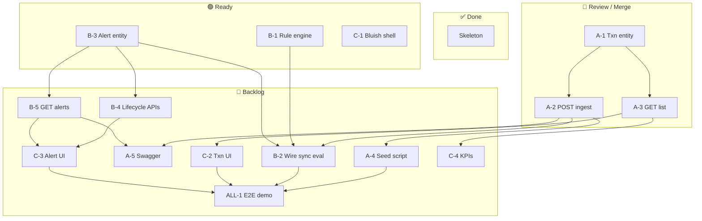

# Kanban Board — Transaction Monitoring & Alerts

**Update this file daily.** Move cards between columns as work progresses.  
Commit message when updating: `chore: kanban update [date]`  
**Milestones:** [`Project_milestones.md`](../Project_milestones.md) · **Stand-ups:** [`STANDUP_LOG.md`](./STANDUP_LOG.md) · **Stories:** [`STORYLINE_AND_KANBAN.md`](./STORYLINE_AND_KANBAN.md)

---

## Board — Sprint 2 (05–11 August 2026)

### ✅ DONE
| Story | Owner | Notes |
|-------|-------|-------|
| Skeleton (Spring Boot + Flyway + React placeholder) | ALL | |
| ER diagram + database design docs | Rameez + shreya | |
| DFD, storyline, team split docs | IamUsike | |

---

### 🔁 REVIEW (PR open — waiting for merge)
| Story | Owner | Branch | PR |
|-------|-------|--------|----|
| [A-1] Transaction entity + repository | shreya | `transaction-api` | ⚠️ **Open PR and merge today** |
| [A-2] POST /transactions ingest | shreya | `transaction-api` | ⚠️ Included in same branch |
| [A-3] GET /transactions + filters | shreya | `transaction-api` | ⚠️ Included in same branch |

---

### 🚧 IN PROGRESS
| Story | Owner | Branch | Started |
|-------|-------|--------|---------|
| *(none yet — start here ↓)* | | | |

---

### 🟢 READY (unblocked — pick up now)
| Story | Owner | Depends on |
|-------|-------|------------|
| [B-1] Rule + RuleEngine + AmountThresholdRule (unit tests) | B | — |
| [B-3] Alert entity + alert_transactions table | B | — |
| [C-1] Bluish UI shell / routing / layout | C | — |

---

### 🔵 BACKLOG (blocked — wait for dependencies)
| Story | Owner | Blocked by |
|-------|-------|------------|
| [A-4] Seed BANK/MERCHANT script | A | A-2 merged |
| [A-5] Swagger / OpenAPI | A | A-2 merged + B-5 |
| [B-2] Wire record → sync rule evaluate | B | A-2 merged + B-1 + B-3 |
| [B-4] Alert lifecycle endpoints (ack/investigate/close/dismiss) | B | B-3 |
| [B-5] GET /alerts + GET /alerts/{id} | B | B-3 |
| [C-2] Transaction list UI (filter by source) | C | A-3 merged |
| [C-3] Alert list + detail + lifecycle buttons | C | B-4 + B-5 |
| [C-4] KPI strip (counts by source, open alerts) | C | A-3 merged |
| [ALL-1] E2E demo (over-threshold → alert → close) | ALL | A-4 + B-2 + C-2 + C-3 |

---

## Dependency map

---

## WIP rules
- **Limit: 1 card In Progress per person** at a time.
- Card moves to **Review** when a PR is opened (not when you think it's done).
- Card moves to **Done** when the PR is merged AND the milestone checkbox is ticked in `Project_milestones.md`.
- PR title must include the story ID: `A-2: POST transactions ingest`.

---

## Phase 2+ parking lot
*(Do not pick these up until ALL-1 E2E demo is Done)*

| Phase | Stories |
|-------|---------|
| 2 | VelocityRule, NewPayeeRule, DailyLimitRule; rules table + config UI; severity colors |
| 3 | Message queue; extract rule engine; cache; read replica |
| 4 | TLS; DB encryption; field masking; full audit trail |

---

*Last updated: 04 August 2026*

