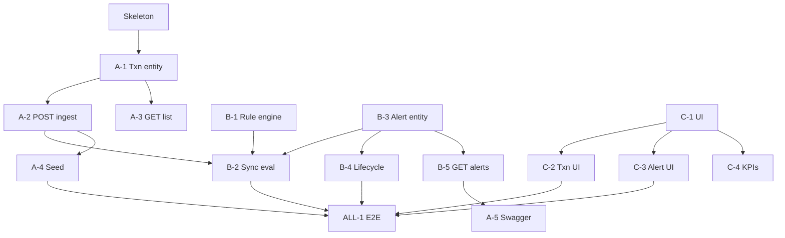

# Kanban Board — Transaction Monitoring & Alerts

**Update this file daily.** Move cards between columns as work progresses.  
Commit message when updating: `chore: kanban update [date]`  
**Milestones:** [`Project_milestones.md`](../Project_milestones.md) · **Stand-ups:** [`STANDUP_LOG.md`](./STANDUP_LOG.md) · **Stories:** [`STORYLINE_AND_KANBAN.md`](./STORYLINE_AND_KANBAN.md) · **User stories (TMD):** [`USER_STORIES.md`](./USER_STORIES.md) · **Meetings:** [`MEETING_NOTES.md`](./MEETING_NOTES.md) · **Retros:** [`SPRINT_RETROSPECTIVE.md`](./SPRINT_RETROSPECTIVE.md) · **Presentation:** [`PRESENTATION_SCRIPT.md`](./PRESENTATION_SCRIPT.md) · **Load test:** [`load-test-results.md`](./load-test-results.md)

---

## Board — Sprint 2 (05–11 August 2026) — live

### ✅ DONE
| Story | Owner | Notes |
|-------|-------|-------|
| Skeleton (Spring Boot + Flyway + React placeholder) | ALL | sathwik led scaffold; team aligned packages |
| ER diagram + database design docs | Rameez + shreya | Rameez ER; shreya schema/API docs |
| DFD, storyline, team split docs | sathwik + ALL | Architecture narrative; team reviewed |
| [C-1] AGIL-ish Dark Obsidian UI shell + left nav routing | Rameez | Operator shell |
| [C-2] Transaction list UI (filter by source) | Rameez | Live API; shreya contract support |
| [C-3] Alert list + detail + lifecycle actions UI | Rameez | Live API; sathwik lifecycle contract |
| [C-4] KPI strip | Rameez | UI; KPI API with shreya |
| [A-1] Transaction entity + repository | shreya | Merged on `dev` |
| [A-2] POST /transactions ingest | shreya | Ingest contract; sathwik wired eval call-site |
| [A-3] GET /transactions + filters | shreya | Envelope + `transactionType` |
| [A-4] Seed BANK/MERCHANT script | shreya | `scripts/seed-demo.sh` |
| [A-5] Swagger / OpenAPI | shreya | `/swagger-ui.html` |
| [B-1] Rule + RuleEngine + AmountThresholdRule | sathwik | Threshold 10000, strict `>`; Rameez test fixes |
| [B-2] Wire record → sync rule evaluate | sathwik + shreya | Call-site in transaction service |
| [B-3] Alert entity + alert_transactions | sathwik | Flyway V2 |
| [B-4] Alert lifecycle endpoints | sathwik | Validated transitions |
| [B-5] GET /alerts + GET /alerts/{id} | sathwik | |
| [ALL-1] E2E MVP path (seed → alert → close) | ALL | Software ready — demo practiced together |
| [B-6] VelocityRule (Phase 2) | sathwik | N txns within T mins; tests with Rameez |
| [B-7] NewPayeeRule (Phase 2) | sathwik | First txn to unseen payee |
| [B-8] DailyLimitRule (Phase 2) | sathwik | Cumulative daily amount |
| [C-5] Frontend flat restyle | Rameez | Dark Obsidian tokens, status dots, mono cells |
| [C-6] Search bar + pause feed button | Rameez | PR #2 merged |
| [C-7] Dashboard graphs / analytics | Rameez | PR #4 |
| [B-9] Configurable rules API + Rules UI | Rameez + sathwik | PR #5; Flyway V3 |
| [T-1] Fix AmountThresholdRuleTest after merge | Rameez | Post-merge cleanup |
| [T-2] Improve rule test coverage + doc workflow | Rameez | Coverage docs added |
| Docker/nginx deployment | sathwik + shreya | compose; shreya env example |
| Jenkins CI update | sathwik | Neueda repo; QA branch tip-offs with shreya |
| [C-8] Severity colours in alert UI | Rameez | Client ask 05 Aug |
| [C-9] Alert status filter + sort in UI | Rameez | API + UI |
| [C-10] Failing reason in alert list/detail | Rameez + shreya | Backend + UI |
| [C-11] Virtual scroll on alerts list | Rameez | `@tanstack/react-virtual` |
| [C-12] Multi-rule alert display | Rameez | Combined rule types / severity |
| [A/B] Pagination + `afterId` delta poll (no full-list poll) | sathwik | List smoothness |
| [A/B] Debounced / fixed search bars | sathwik | |
| [QA-1] E2E + k6 Pass 1–3 + write-up | shreya (+ sathwik) | `docs/load-test-results.md` |

---

### 🔁 REVIEW
| Story | Owner | Branch | PR |
|-------|-------|--------|----|
| *(none)* | | | |

---

### 🚧 IN PROGRESS
| Story | Owner | Branch | Started |
|-------|-------|--------|---------|
| Queue + DB VM migration (Phase 3) | sathwik | `feature/phase3-scale-out` / related | 06 Aug |
| Alert / traffic simulator | shreya | `simulator` / related | 06 Aug |
| Final unit-test sweep | ALL | `dev` | 06 Aug |
| Login page + superadmin user | sathwik | `dev` | 05 Aug |

---

### 🟢 READY
| Story | Owner | Depends on / notes |
|-------|-------|-------------------|
| Final presentation dry-run | ALL | Script: `PRESENTATION_SCRIPT.md` |
| Re-run k6 Pass 3 after DB split | shreya + sathwik | Baseline in `load-test-results.md` |

---

### 🔵 BACKLOG
| Story | Owner | Notes |
|-------|-------|-------|
| Extract rule engine + horizontal workers | sathwik + shreya | Phase 3 remaining |
| TLS / masking / audit hardening | ALL | Phase 4 |
| “Mark suspicious” rename | — | **Dropped — not needed** |

---

## Board — Sprint 1 (29 July – 4 August 2026) — archived

Snapshot of the board **at Sprint 1 close** (04 Aug retrospective). Kept for audit / instructor review — do not move cards here; use the Sprint 2 board above.

### ✅ DONE
| Story | Owner | Notes |
|-------|-------|-------|
| Project skeleton (Spring Boot + Flyway + React placeholder) | ALL / sathwik | Booking demo → txnmonitor |
| Package structure (`api`, `transaction`, `rule`, `alert`, `common`) | sathwik | Matches AGENTS conventions |
| ER diagram | Rameez | Iterated on feedback |
| DATABASE_DESIGN + API endpoint docs | shreya + Rameez | |
| DFD-MVP, storyline, team split, kanban docs | sathwik | 04 Aug |
| CI scaffolding (Dockerfile, compose, Jenkinsfile) | sathwik | Present early |

### 🔁 REVIEW
| Story | Owner | Branch | Notes |
|-------|-------|--------|-------|
| *(none — no PRs opened in Sprint 1)* | | | |

### 🚧 IN PROGRESS / stuck off-board
| Story | Owner | Branch | Notes |
|-------|-------|--------|-------|
| [A-1] Transaction entity + repository | shreya | `transaction-api` | Code + tests done — **not merged to `dev`** |
| [A-2] POST /transactions ingest | shreya | `transaction-api` | Same |
| [A-3] GET /transactions + filters | shreya | `transaction-api` | Same |

### 🟢 READY (planned for Sprint 2 start)
| Story | Owner | Depends on |
|-------|-------|------------|
| Merge `transaction-api` → `dev` | shreya + sathwik | Unblocks B + C |
| [B-1] Rule + AmountThresholdRule (TDD) | B | A-2 in `dev` |
| [B-3] Alert entity + alert_transactions | B | — |
| [C-1] UI shell / routing | C | — |

### 🔵 BACKLOG (rest of MVP at Sprint 1 end)
| Story | Owner | Notes |
|-------|-------|-------|
| [B-2] Wire record → sync evaluate | A + B | |
| [B-4] Alert lifecycle APIs | B | |
| [B-5] GET /alerts | B | |
| [C-2]–[C-4] Txn list, alerts UI, KPIs | C | |
| [A-4] Seed script · [A-5] Swagger · [ALL-1] E2E demo | shared | |
| Phase 2–4 parking lot | — | See below |

### Sprint 1 board notes
- Goal ~40% met in shared `dev` (skeleton + docs); txn API complete but siloed.
- WIP / merge discipline failed: no PRs, `transaction-api` blocked the team.
- Full write-up: [`SPRINT_RETROSPECTIVE.md`](./SPRINT_RETROSPECTIVE.md) § Sprint 1.

---

## Dependency map (Phase 1 — complete)

---

## WIP rules
- **Limit: 1 card In Progress per person** at a time.
- Card moves to **Review** when a PR is opened (not when you think it's done).
- Card moves to **Done** when the PR is merged AND the milestone checkbox is ticked in `Project_milestones.md`.
- PR title must include the story ID: `A-2: POST transactions ingest`.

---

## Phase 2+ parking lot

| Phase | Stories |
|-------|---------|
| 2 | ~~VelocityRule~~, ~~NewPayeeRule~~, ~~DailyLimitRule~~; rules table + config UI + explanations; severity colors; failing reason; alert status filter/sort; dashboard graphs |
| 3 | Message queue; extract rule engine; cache; read replica |
| 4 | TLS; DB encryption; field masking; full audit trail |

---

*Last updated: 06 August 2026 — ownership rebalanced across A/B/C; Sprint 1 board archived; QA + login + client Ready cards in flight*
