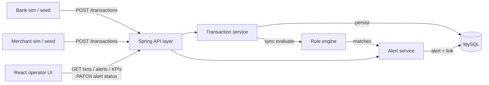

# MVP Presentation — Transaction Monitoring & Alerts

**Audience:** instructors / stakeholders · **Length:** ~15–20 minutes  
**Status:** Phase 1 MVP **ready for live demo** (04 August 2026)  
**Talk track + deep dive** for the team. Slide speakers can follow Part A;
Part B is the full system explanation if someone asks “how does it actually work?”

Related docs: [`MVP_STATUS.md`](./MVP_STATUS.md) · [`DFD-MVP.md`](./DFD-MVP.md) ·
[`DATABASE_DESIGN.md`](./DATABASE_DESIGN.md) · [`Project_milestones.md`](../Project_milestones.md)

---

## Part A — Presentation talk track

### 1. Team (1 min)

| Role | Focus |
|------|--------|
| **A — Transactions & API** | Ingest/query, soft tenancy fields, seed script, Swagger, dashboard KPIs |
| **B — Rules & Alerts** | Rule engine, Amount Threshold, alert create + lifecycle |
| **C — Frontend & Demo** | Operator dashboard, live API clients, E2E walkthrough |

*(Replace with real names from [`TEAM_WORK_SPLIT.md`](./TEAM_WORK_SPLIT.md).)*

**One-liner:** We built a modular Spring Boot monolith plus a React operator
dashboard that ingests simulated bank/merchant traffic, detects over-threshold
payments in the same request, and walks alerts through a validated lifecycle.

---

### 2. What we were asked to do (2 min)

Banks and merchants generate payment traffic. We needed a system that:

1. **Records** transactions from multiple sources (soft tenancy — one DB).
2. **Evaluates** each persisted transaction against monitoring rules.
3. **Creates alerts** when a rule fires, with a full lifecycle:
   `OPEN → ACKNOWLEDGED → INVESTIGATING → CLOSED` (or `DISMISSED`).
4. Gives a **single operator** a UI to list transactions, triage alerts, and
   close the loop — no auth for MVP.

**MVP scope (what we shipped):** Amount Threshold rule only, synchronous
evaluate-on-record, React dashboard, seed script.  
**Explicitly later:** Velocity / New Payee / Daily Limit, async queue + scaled
rule workers, configurable rules UI, TLS/masking hardening, ML.

---

### 3. How we approached it (2 min)

- **Modular monolith** — one deployable JVM: packages `api`, `transaction`,
  `rule`, `alert`, `common`. Not microservices for MVP; clean boundaries so
  the **rule engine** can be extracted later without a rewrite.
- **Build order** — transactions → rule engine → alerts → UI → seed/demo.
- **TDD on core logic** — especially rule evaluation and illegal lifecycle
  transitions.
- **Soft tenancy** — every transaction (and denormalized alert) carries
  `sourceType` / `sourceId` / `sourceName` (`BANK` or `MERCHANT`). Same ingest
  API for every feed; simulators are just clients.
- **Frontend last against live APIs** — sample-data fallback removed; empty
  state + errors if the API is down.

**Stack:** Java 21+ / Spring Boot 3, MySQL + Flyway, React + Vite, springdoc
OpenAPI. Ports: API **8081**, UI **5173**.

---

### 4. Architecture (2 min) — show this diagram



**Key story for MTTD:** detection happens **inside the ingest request**. No
queue in MVP. Phase 3 changes *when* evaluation runs, not *whether* every
saved transaction is evaluated.

---

### 5. Data model (1–2 min)

Three tables (Flyway `V1` + `V2`):

| Table | Role |
|-------|------|
| `transactions` | Every ingested payment + soft-tenancy + account/payee fields |
| `alerts` | Status, severity, rule type, denormalized source fields, timestamps, notes |
| `alert_transactions` | Many-to-many link (Amount Threshold → one txn; Velocity later → many) |

No `rules` / `sources` / `accounts` master tables in MVP — rules are
hardcoded; source and payee names are denormalized on the row.

**Amount Threshold:** amount **strictly greater than** `10000` → match,
severity `HIGH`, alert status `OPEN`.

---

### 6. Live demo script (5–7 min)

**Prep (before the room):**

```bash
docker compose up -d mysql   # if needed
./mvnw spring-boot:run       # API :8081
cd frontend && npm run dev   # UI :5173
```

**Script:**

1. **Quiet dashboard** — open `http://localhost:5173` → Dashboard KPIs
   (zeros or previous run counts).
2. **Seed traffic** — from another terminal:
   ```bash
   ./scripts/seed-demo.sh
   # remote VM: API_BASE=http://<host>:8081 ./scripts/seed-demo.sh
   ```
   Posts: BANK ₹2500 (no alert), MERCHANT ₹149.99 (no alert), BANK ₹25000
   (creates `OPEN` alert).
3. **Transactions** — list shows BANK + MERCHANT; filter by source.
4. **Alerts** — open the over-threshold alert; show linked transaction,
   source name, payee, amount.
5. **Lifecycle** — Acknowledge → Investigate → Close (optional notes).
   Show invalid jumps are rejected by the API if asked.
6. **KPIs** — refresh dashboard; open/closed counts move.
7. **Swagger** (optional) — `http://localhost:8081/swagger-ui.html`.

**Optional curl for a second spike:**

```bash
curl -sS -X POST http://localhost:8081/api/v1/transactions \
  -H 'Content-Type: application/json' \
  -d '{"sourceType":"BANK","sourceId":"HSBC-UK","sourceName":"HSBC United Kingdom","accountId":"ACC-1001","payeeId":"PAYEE-X","payeeName":"Wire Co","amount":15000,"currency":"INR","type":"TRANSFER","timestamp":"2026-08-04T10:00:00","status":"COMPLETED"}'
```

---

### 7. Challenges & what we’d do differently (2 min)

- **Contract alignment** — frontend expected `{success,message,data}` and
  `transactionType`; we wrapped transaction APIs and aliased JSON so the UI
  and backend speak the same language.
- **Java + Mockito** — mocking concrete engine/services bit us on newer JDKs;
  prefer stubs/interfaces for tests.
- **Soft tenancy without a sources table** — simpler MVP; Phase 2 may want a
  master if operators need to manage feeds.
- **Sample fallback** — useful early for UI, dangerous for demos; removed so
  the screen never lies about backend health.

---

### 8. What’s next if we had more time (1 min)

| Phase | Next beats |
|-------|------------|
| **2** | Velocity, New Payee, Daily Limit; rules table + operator-tunable thresholds |
| **3** | Queue between ingest and evaluate; extract rule workers; cache; read replica |
| **4** | TLS, encryption at rest, field masking, richer audit of who changed status |

---

### 9. Close

Thanks — any questions?  
*(Previous group / next group: please ask us one question.)*

---

## Part B — In-depth system explanation

### B.1 Problem in product terms

Operators need a single place to see **what money moved**, **which sources
sent it**, and **which payments look risky**, then record a decision
(acknowledge → investigate → close/dismiss). Feeds are simulated: any client
that can `POST /api/v1/transactions` is a “bank” or “merchant” for MVP.

### B.2 Modular monolith — why and how

| Package | Responsibility | Must not do |
|---------|----------------|-------------|
| `api` | HTTP mapping, validation, DTO in/out, CORS, OpenAPI | Business rules, JPA entities returned raw |
| `transaction` | Persist + query transactions; orchestrate post-save evaluate | Own alert lifecycle rules |
| `rule` | `Rule` interface, `RuleEngine`, `AmountThresholdRule` | Persist alerts or know HTTP |
| `alert` | Create from matches; validate transitions; list/detail | Own transaction ingest |
| `common` | `ApiResponse`, exception handler, shared config | Domain ownership of txn/alert |

**Extension rule:** new rule type = new class implementing `Rule`. Do not
change `RuleEngine`’s contract to special-case a rule.

**Sync path inside `TransactionService.saveTransaction` (conceptual):**

1. Map request → entity → save.
2. Build `TransactionSnapshot` → `ruleEngine.evaluate(...)`.
3. For each `RuleMatch`, `alertService.createFromMatch(...)` → `OPEN` alert +
   `alert_transactions` row.
4. Return transaction DTO in `{ success, message, data }` envelope.

### B.3 Soft tenancy

One MySQL database. Isolation is **logical** via columns:

- `source_type` — `BANK` | `MERCHANT`
- `source_id` — stable code (`HSBC-UK`, `ACME-POS`)
- `source_name` — display label

Filters on `GET /transactions` and `GET /alerts` use these fields. Alerts
copy source fields at creation time so history stays readable if feeds rename
later.

### B.4 Rule engine (MVP)

- Interface: `Rule.evaluate(TransactionSnapshot, RuleEvaluationContext)`.
- MVP context is mostly a no-op (Amount Threshold needs only the amount).
- Registered rule: `AmountThresholdRule` with threshold **10000**, comparison
  **`>`** (equal does not fire).
- Match carries rule type `AMOUNT_THRESHOLD` and severity `HIGH`.
- Unit-tested independently of HTTP/DB so Phase 2 rules plug in the same way.

### B.5 Alert lifecycle (enforced in service, not DB)

```
OPEN          → ACKNOWLEDGED
ACKNOWLEDGED  → INVESTIGATING | DISMISSED
INVESTIGATING → CLOSED | DISMISSED
CLOSED / DISMISSED → terminal
```

`PATCH /api/v1/alerts/{id}/status` with `{ "status": "...", "notes": "..." }`.
Illegal transitions → `InvalidAlertTransitionException` → 4xx via global
handler. Timestamps (`acknowledgedAt`, `closedAt`, etc.) update with the
transition.

### B.6 API surface (implemented)

| Method | Path | Purpose |
|--------|------|---------|
| `POST` | `/api/v1/transactions` | Ingest (+ sync evaluate) |
| `GET` | `/api/v1/transactions` | List; optional `sourceType`, `sourceId`, `accountId` |
| `GET` | `/api/v1/transactions/{id}` | Detail |
| `GET` | `/api/v1/transactions/account/{accountId}` | By account |
| `GET` | `/api/v1/transactions/status/{status}` | By status |
| `GET` | `/api/v1/transactions/type/{type}` | By type |
| `GET` | `/api/v1/alerts` | List; optional source/status filters |
| `GET` | `/api/v1/alerts/{alertId}` | Detail + linked transactions |
| `PATCH` | `/api/v1/alerts/{alertId}/status` | Lifecycle |
| `GET` | `/api/v1/dashboard` | KPI counts |

**Success envelope:**

```json
{ "success": true, "message": "...", "data": { } }
```

JSON field for transfer kind on transactions: `transactionType` (request also
accepts `type` via alias).

Swagger UI: `/swagger-ui.html`.

### B.7 Frontend

- Vite React app; routes: Dashboard, Transactions, Alerts.
- Typed clients under `frontend/src/api/`; hooks unwrap `envelope.data`.
- **No sample-data fallback** — API failure → empty lists + warning banner.
- Theme: Dark Obsidian / slate operator UI; left nav; zero horizontal scroll.
- UI does **not** post transactions; seed/curl/simulators do.

### B.8 Seed / simulate

`scripts/seed-demo.sh` posts three transactions against `API_BASE`
(default `http://localhost:8081`):

| # | Source | Amount | Alert? |
|---|--------|--------|--------|
| 1 | BANK / HSBC-UK | 2500 | No |
| 2 | MERCHANT / ACME-POS | 149.99 | No |
| 3 | BANK / HSBC-UK | 25000 | Yes — `OPEN` |

That is the entire “quiet morning → spike → investigate” story in one script.

### B.9 What “MVP ready” means

| Criterion | Status |
|-----------|--------|
| Every persisted txn evaluated synchronously | Yes |
| Over-threshold → `OPEN` alert + link | Yes |
| Validated lifecycle APIs + UI actions | Yes |
| Live UI for txns, alerts, KPIs | Yes |
| Seed without manual SQL | Yes |
| Swagger available | Yes |
| Phase 2+ rules / queue / auth | Out of scope |

Remaining ceremony: run the live dry-run in front of the team/instructors
(mark `ALL-1` / E2E checkbox after that room demo).

### B.10 Design decisions worth defending in Q&A

1. **Why monolith?** Faster MVP delivery; packages enforce boundaries; rule
   engine already behind an interface for later extraction.
2. **Why sync evaluate?** Meets MTTD story for training scale; queue is Phase 3.
3. **Why hardcoded threshold?** Spec allows hardcoded rules first; config UI
   is Phase 2.
4. **Why soft tenancy?** Spec: no hard per-bank DBs; one schema, tagged rows.
5. **Why no auth?** Spec: single operator assumed.
6. **Why link table for alerts?** Amount Threshold uses one row; Velocity will
   need many without schema churn.

---

## Quick reference card (print / last slide)

| Item | Value |
|------|-------|
| UI (dev) | http://localhost:5173 |
| UI (Docker/VM) | http://\<VM_IP\>:8082/ (nginx internal :80) |
| API | http://localhost:8081 or http://\<VM_IP\>:8081 |
| Swagger | http://localhost:8081/swagger-ui.html |
| Seed | `./scripts/seed-demo.sh` · VM: `API_BASE=http://\<VM_IP\>:8081 ./scripts/seed-demo.sh` |
| Threshold | amount **> 10000** |
| Lifecycle | OPEN → ACK → INVESTIGATING → CLOSED / DISMISSED |
| Stack | Spring Boot + MySQL/Flyway + React/Vite (+ nginx in Docker) |
| Branch | `dev` |
