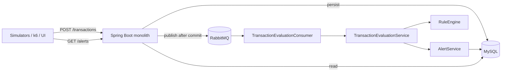

# Phase 3 — Scale-out (Implemented)

Last updated: 06 August 2026

This document describes what is **implemented** in the repo for Phase 3 scale-out.
For the original planning notes see [`.cursor/plans/008-phase3-scale-out.md`](../.cursor/plans/008-phase3-scale-out.md).

---

## Summary

Phase 3 decouples **transaction ingest** from **rule evaluation** so HTTP threads
are not blocked under load, and prepares the system for a **dedicated MySQL VM**
so the JVM and database stop competing for CPU/RAM/disk on one box.

| Slice | Status | What |
|-------|--------|------|
| **3a** | Config ready | `docker-compose.prod.yml` — app + RabbitMQ; MySQL via external `DB_URL` |
| **3b** | Done | RabbitMQ queue + in-process async consumer |
| **3c** | Not started | Extract rule engine as separate JVM worker |
| **3d** | Done | Caffeine cache for velocity / new-payee / daily-limit lookups |
| **3e** | Not started | Read replica for dashboard/list reads |

---

## Architecture (current)



The monolith still contains API, transaction, rule, and alert packages in **one
deployable**. Only evaluation timing changed — not the modular monolith boundary.

---

## Evaluation modes

Controlled by `txnmonitor.evaluation.mode`:

| Mode | Behaviour | Default in |
|------|-----------|------------|
| `sync` | Save → evaluate rules → create alerts in the same request | `dev`, `test`, local `./mvnw spring-boot:run` |
| `async` | Save → publish to queue → return; consumer evaluates later | `docker` profile (compose / VM deploy) |

### Async path (step by step)

1. `TransactionService.saveTransaction()` persists the row (`@Transactional`).
2. On commit, `TransactionEvaluationRequestedEvent` fires.
3. `TransactionEvaluationEventListener` (`AFTER_COMMIT`) publishes to RabbitMQ.
4. `TransactionEvaluationConsumer` receives `{ transactionId, publishedAt }`.
5. `TransactionEvaluationService.evaluateByTransactionId()` loads the txn, runs
   `RuleEngine`, calls `AlertService.createFromMatches()`.

Only the transaction **ID** is queued — the worker always reads fresh data from MySQL.

---

## RabbitMQ

| Item | Value |
|------|-------|
| Exchange | `txn.events` (direct, durable) |
| Queue | `txn.evaluation` |
| Routing key | `evaluation.requested` |
| Dead-letter queue | `txn.evaluation.dlq` |

Management UI (dev): `http://<host>:15672/` — default `guest` / `guest`.

---

## Configuration reference

| Property | Dev / test | Docker / VM |
|----------|------------|---------------|
| `txnmonitor.evaluation.mode` | `sync` | `async` |
| `txnmonitor.rule-evaluation.cache.enabled` | `false` | `true` |
| `spring.rabbitmq.host` | `localhost` (if testing async locally) | `rabbitmq` |
| `DB_URL` | `localhost:3306` | remote DB VM JDBC URL |
| Hikari `maximum-pool-size` | default | `20` (in `application-docker.properties`) |

Test profile excludes Rabbit auto-config so `./mvnw test` does not need a broker.

---

## New / changed code (by package)

### `transaction`
- `TransactionEvaluator` — interface shared by sync path, consumer, future worker
- `TransactionEvaluationService` — load txn → evaluate → alert
- `TransactionEvaluationPublisher` / `RabbitTransactionEvaluationPublisher`
- `TransactionEvaluationEventListener` — publish after DB commit
- `TransactionEvaluationConsumer` — `@RabbitListener` on `txn.evaluation`
- `TransactionService` — branches on sync vs async

### `rule`
- `CachingRuleEvaluationContext` — Caffeine decorator over repository lookups
- `RuleEngineConfig` — optionally wraps context with cache

### `alert`
- `AlertService.createFromMatches()` — skips duplicate `(transactionId, ruleType)`
- `AlertRepository.existsByTransactionIdAndRuleType()` — dedup query

### `api`
- `InternalAlertController` — `POST /internal/alerts` (for future extracted worker)

### `common/config`
- `TxnMonitorProperties` — evaluation mode + cache flags
- `RabbitMqConfig` — exchange, queue, DLQ, JSON converter

### Infra
- `docker-compose.yml` — added `rabbitmq` service
- `docker-compose.prod.yml` — no local MySQL; requires `DB_URL` + `DB_PASS`
- `pom.xml` — `spring-boot-starter-amqp`, `caffeine`

### Migrations
- Renamed duplicate Flyway script: `V3__add_alert_...` → **`V4__add_alert_rule_description_and_failing_reason.sql`**
  (fixes conflict with `V3__create_rule_configs.sql`)

---

## Internal API (implemented)

`POST /internal/alerts` — not in Swagger; for service-to-service use when the rule
engine is extracted to its own JVM.

**Request:**
```json
{
  "transactionId": 101,
  "matches": [
    {
      "ruleType": "AMOUNT_THRESHOLD",
      "severity": "HIGH",
      "reason": "Amount 25000 exceeds threshold 10000",
      "transactionId": 101
    }
  ]
}
```

**Response:** array of `AlertResponse` (same shape as public alert APIs).

See also [`INTERNAL_API_ENDPOINT.MD`](./INTERNAL_API_ENDPOINT.MD) — update that
draft to match this contract when presenting.

---

## Deploy topologies

### Local dev (unchanged habit)
```bash
docker compose up -d mysql          # DB only
./mvnw spring-boot:run              # sync evaluation, no RabbitMQ required
```

### Local full stack (async, like VM)
```bash
docker compose up -d                # mysql + rabbitmq + api + frontend
# API uses docker profile → async evaluation
```

### Two-VM production-like
See **[`DB_VM_MIGRATION.md`](./DB_VM_MIGRATION.md)** for the full MySQL migration guide.

Quick version — **app VM**:
```bash
export DB_URL='jdbc:mysql://<DB_VM_IP>:3306/txnmonitor?useSSL=false&allowPublicKeyRetrieval=true&serverTimezone=UTC'
export DB_PASS='<root-or-app-password>'
export VITE_API_BASE_URL='http://<APP_VM_IP>:8081'

docker compose -f docker-compose.prod.yml up -d --build
```

---

## MTTD note

| Phase | MTTD meaning |
|-------|----------------|
| MVP / sync | Alert creatable within the same `POST /transactions` request path |
| Phase 3 / async | MTTD = queue lag + consumer processing; typically seconds under normal load |

Measure with k6: POST txn → poll `GET /alerts` until new alert appears. Document
p95 before/after when shreya re-runs load tests.

---

## What's next (not implemented)

1. **3c** — Standalone `rule-worker` JVM consuming the same queue, calling
   `POST /internal/alerts` instead of in-process `AlertService`.
2. **3e** — MySQL read replica; route `GET /transactions`, `GET /alerts`, KPI
   queries to replica; keep writes + rule lookups on primary.
3. **Load test write-up** — sync vs async vs dedicated DB VM comparison table.

---

## Related docs

- [`DB_VM_MIGRATION.md`](./DB_VM_MIGRATION.md) — step-by-step MySQL VM setup
- [`DFD-MVP.md`](./DFD-MVP.md) — Phase 3 contrast diagram
- [`Project_milestones.md`](../Project_milestones.md) — milestone checklist
- [`README.md`](../README.md) — quick deploy commands
