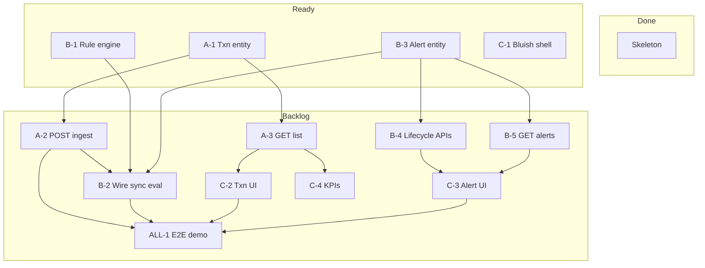

# Storyline & Kanban — 3-Person Team

Living board for the Transaction Monitoring & Alerts project.  
**Owners:** Person A (Transactions), Person B (Rules & Alerts), Person C (Frontend).  
**Status source:** [`Project_milestones.md`](../Project_milestones.md) · **Roles:** [`TEAM_WORK_SPLIT.md`](./TEAM_WORK_SPLIT.md)

Replace *\<Name 1/2/3\>* with real names when you have them.

| Role | Name | Focus |
|------|------|--------|
| **A** | *\<Name 1\>* | Ingest API, transactions, simulate/seed, Swagger, KPIs API |
| **B** | *\<Name 2\>* | Rule engine, alerts, lifecycle, sync MTTD path |
| **C** | *\<Name 3\>* | Bluish UI, lists/detail, KPI strip, E2E demo |

---

## 1. Product storyline (what we are building)

### The pitch (30 seconds)

Banks and merchants generate payment traffic all day. Our platform **ingests**
those transactions (we **simulate** the feeds), **evaluates** each one against
monitoring rules the moment it lands, and gives a single operator a
**bluish dashboard** to spot alerts, investigate, and close them — with a
clear trail from “money moved” to “risk reviewed.”

### Characters

| Character | Role in the story |
|-----------|-------------------|
| **HSBC-UK** (bank sim) | Pushes transfers with `sourceType=BANK` |
| **ACME-POS** (merchant sim) | Pushes card/POS-like txns with `sourceType=MERCHANT` |
| **Operator** (Person C’s UI) | Watches KPIs, opens alerts, walks lifecycle |
| **Rules** (Person B) | Amount Threshold first; more rules later |
| **Platform** (Person A’s API) | One public ingest contract for every source |

### Demo arc (Phase 1 “hero journey”)

1. **Quiet morning** — Operator sees a bluish dashboard: txn counts by
   source, open alerts ≈ 0.
2. **Traffic arrives** — Seed/simulate script (or curl) posts normal
   amounts from HSBC-UK and ACME-POS. Transaction list fills; filters by
   source work. No alerts.
3. **Spike** — A ₹/USD transfer **above threshold** posts from the bank
   sim. Same request: rule engine fires → alert `OPEN`.
4. **Investigate** — Operator opens the alert, sees source name, account,
   payee, location, linked transaction.
5. **Resolve** — Acknowledge → Investigate → Close (with notes), or
   Dismiss if false positive.
6. **Close the loop** — KPI strip updates; history shows the closed alert.
   MTTD story: detection happened **in the ingest request** (no queue yet).

### Later chapters (don’t build early)

| Phase | Story beat |
|-------|------------|
| **2** | Velocity / new payee / daily limit; operator can **tune** thresholds |
| **3** | Volume rises — queue + scaled rule workers; MTTD still low under load |
| **4** | Encryption, masking of sensitive fields, full audit “who changed what” |

### Out of the story (never cast)

ML anomaly detection, multi-login auth, real SWIFT/network bank hooks,
separate DB per bank.

---

## 2. Epics (themes)

| ID | Epic | Primary owner |
|----|------|----------------|
| E1 | Ingest & query transactions (multi-source) | A |
| E2 | Detect risk (rule engine, sync) | B |
| E3 | Manage alerts (lifecycle + APIs) | B |
| E4 | Operator experience (bluish UI + KPIs) | C |
| E5 | Demo readiness (seed, Swagger, E2E) | A + C (+ B) |
| E6 | Richer rules + config (Phase 2) | B + C |
| E7 | Scale-out (Phase 3) | B + A |
| E8 | Security & hardening (Phase 4) | A + B + C |

---

## 3. User stories (Phase 1)

Format: **As a … I want … so that …** · Points are relative (1/2/3/5).

### Epic E1 — Ingest (A)

| ID | Story | Pts | Depends |
|----|--------|-----|---------|
| A-1 | As the platform, I want a Transaction entity/repo matching the enriched schema so we can persist bank/merchant txns | 3 | — |
| A-2 | As a bank/merchant simulator, I want `POST /transactions` with `sourceType/Id/Name` so one API accepts all feeds | 5 | A-1 |
| A-3 | As an operator API client, I want `GET /transactions` with source/account filters so the UI can search | 3 | A-1 |
| A-4 | As a demo runner, I want a seed script posting sample BANK + MERCHANT txns so the board isn’t empty | 2 | A-2 |

### Epic E2 — Detect (B)

| ID | Story | Pts | Depends |
|----|--------|-----|---------|
| B-1 | As the system, I want `Rule` + `RuleEngine` + `AmountThresholdRule` (hardcoded) so every saved txn is evaluated | 5 | — |
| B-2 | As the system, I want record→evaluate wired synchronously so MTTD is “same request” | 3 | A-2, B-1, B-3 |

### Epic E3 — Alerts (B)

| ID | Story | Pts | Depends |
|----|--------|-----|---------|
| B-3 | As the system, I want Alert entity + `alert_transactions` (+ denormalized source fields) so firings are stored | 5 | — |
| B-4 | As an operator, I want lifecycle APIs (ack / investigate / close / dismiss) with validated transitions | 5 | B-3 |
| B-5 | As an operator, I want `GET /alerts` and `GET /alerts/{id}` (with txns, filter by source) | 3 | B-3 |

### Epic E4 — UI (C)

| ID | Story | Pts | Depends |
|----|--------|-----|---------|
| C-1 | As an operator, I want a bluish themed shell so the dashboard feels intentional | 2 | — |
| C-2 | As an operator, I want a transaction list with source filters so I can see bank vs merchant traffic | 5 | A-3 |
| C-3 | As an operator, I want alert list + detail + lifecycle buttons so I can work a case | 5 | B-4, B-5 |
| C-4 | As an operator, I want a basic KPI strip (counts by source, open alerts) | 3 | A-3 or KPI endpoint |

### Epic E5 — Demo (shared)

| ID | Story | Pts | Depends |
|----|--------|-----|---------|
| A-5 | As developers, we want Swagger/OpenAPI so ingest and alerts are easy to try | 2 | A-2, B-5 |
| ALL-1 | As the team, we want an E2E demo: over-threshold sim → alert → close in UI | 5 | A-4, B-2, C-2, C-3 |

---

## 4. Kanban board (Phase 1)

Columns: **Backlog → Ready → In progress → Review → Done**.  
Move a card when the story’s acceptance is met; update
[`Project_milestones.md`](../Project_milestones.md) when a milestone checkbox
lands.

### Board snapshot (start of Phase 1 coding)

```text
DONE
  [x] Skeleton (Spring Boot + Flyway V1 + frontend placeholder)     ALL

IN PROGRESS
  (none — start here ↓)

READY (unblocked now)
  [A-1] Transaction entity + repository                             A
  [B-1] Rule + RuleEngine + AmountThreshold (unit tests)            B
  [B-3] Alert entity + alert_transactions                           B
  [C-1] Bluish UI shell / layout                                    C

BACKLOG (wait on Ready/Done)
  [A-2] POST /transactions ingest                                   A  ← A-1
  [A-3] GET /transactions + filters                                 A  ← A-1
  [A-4] Seed BANK/MERCHANT script                                   A  ← A-2
  [A-5] Swagger                                                     A  ← A-2, B-5
  [B-2] Wire record → sync evaluate                                 B  ← A-2, B-1, B-3
  [B-4] Alert lifecycle endpoints                                   B  ← B-3
  [B-5] GET /alerts (+ detail)                                      B  ← B-3
  [C-2] Transaction list UI                                         C  ← A-3
  [C-3] Alert list/detail/actions UI                                C  ← B-4, B-5
  [C-4] KPI strip                                                   C  ← A-3
  [ALL-1] E2E demo                                                  ALL ← A-4, B-2, C-2, C-3
```

### Mermaid swimlanes (same board)



### How to run the board day-to-day

1. Each person pulls **one** Ready card into In progress (WIP limit = 1–2).
2. PR title includes story ID (`A-2: POST transactions ingest`).
3. Review column = PR open; Done = merged + milestone checkbox ticked.
4. After A-2 and B-3 exist, promote B-2 to Ready and pair on the wire-up.
5. C stays on C-1 until A-3/B-5 land; then burn down UI stories.

---

## 5. Acceptance cheat-sheet (Phase 1 “done”)

| Story | Done when |
|-------|-----------|
| A-1 | Entity maps to V1 columns; repo save/load test green |
| A-2 | POST persists + returns 201; validates sourceType BANK/MERCHANT |
| A-3 | GET filters by sourceType/sourceId/accountId |
| B-1 | Unit tests: above / below / boundary threshold |
| B-2 | POST over threshold creates alert in same flow |
| B-3–B-5 | Lifecycle rejects illegal transitions; GET returns linked txns |
| C-2–C-3 | UI shows sourceName; lifecycle buttons call APIs |
| ALL-1 | Live demo script works without manual SQL |

---

## 6. Phase 2–4 backlog (parking lot)

Keep on a second board or below the fold until Phase 1 E2E is Done.

| Phase | Cards (owner) |
|-------|----------------|
| 2 | Velocity / NewPayee / DailyLimit (B); rules table + UI (B/C); severity colors (C) |
| 3 | Queue (B); extract engine (B); internal alert API stability (A); cache (B); read replica KPIs (A) |
| 4 | TLS + secrets (A); encryption at rest (A); field masking UI (C); audit history (B) |

---

## 7. Copy-paste: GitHub Projects / Trello columns

Create columns: `Backlog` | `Ready` | `In progress` | `Review` | `Done`.  
Labels: `A`, `B`, `C`, `Phase-1`, `Phase-2`, `blocked`.  
Card title examples:

- `[A-1][P1] Transaction entity + repository`
- `[B-1][P1] AmountThresholdRule + RuleEngine`
- `[C-1][P1] Bluish dashboard shell`
- `[ALL-1][P1] E2E demo bank over-threshold`

---

*Last updated: 04 August 2026 — aligned with multi-source soft tenancy and lean MVP.*
