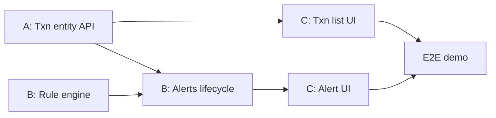

# Team Work Split — Transaction Monitoring & Alerts

**Team size:** 3  
**Names:** fill in below (replace the placeholders)  
**Source of truth for status:** [`Project_milestones.md`](../Project_milestones.md)  
**Conventions:** [`AGENTS.md`](../AGENTS.md), [`.cursor/rules/`](../.cursor/rules/)

| Role | Name | Primary ownership |
|------|------|-------------------|
| **Person A** — Transactions & API | *\<Name 1\>* | `transaction` module, public REST for transactions, Swagger, test data |
| **Person B** — Rules & Alerts | *\<Name 2\>* | `rule` module, `alert` module, wiring eval → alert creation |
| **Person C** — Frontend & Demo | *\<Name 3\>* | `frontend/`, typed API clients, E2E demo path in the UI |

Shared for everyone: `common` (exceptions, shared config), schema decisions in
[`DATABASE_DESIGN.md`](./DATABASE_DESIGN.md), updating milestones when a
checkbox is done.

---

## Why this split

The backend is a **modular monolith** with clear packages
(`api`, `transaction`, `rule`, `alert`, `common`). The rule engine is the
piece designed to extract later — keep it behind `Rule` /
`RuleEngine` so Person B owns that boundary.

Frontend must not invent endpoints ahead of the backend
([`frontend-react.mdc`](../.cursor/rules/frontend-react.mdc)).

MVP still has a **build order**. Parallelism is real, but later items
wait on earlier contracts (see sequencing below).

---

## Phase 1 — MVP (current)

Skeleton is **done**. Remaining work:

### Person A — Transactions & API

| Milestone item | Notes |
|----------------|--------|
| Transaction entity + repository | Fields per milestones / DB design; TDD |
| `POST /transactions`, `GET /transactions` | Controllers/DTOs in `api`; service in `transaction`; list + filter/search |
| Swagger / OpenAPI | Once transaction (and later alert) endpoints exist |
| Test data generator | Script or endpoint that hits the API |

**Owns packages:** `transaction`, transaction-related types under `api`  
**Does not own:** rule evaluation logic, alert lifecycle UI

**Hand-off contract for B:**  
`TransactionService.record(...)` persists a transaction and exposes a
hook/call site where B will invoke `RuleEngine.evaluate(...)` (Person B
implements the engine; A and B agree the method signature early).

### Person B — Rules & Alerts

| Milestone item | Notes |
|----------------|--------|
| Rule engine skeleton | `Rule`, `RuleEngine`, `AmountThresholdRule` (hardcoded threshold) |
| Wire recording → sync evaluation | Called from transaction record path; no queue yet |
| Alert entity + repository + `alert_transactions` | Flyway migration(s); junction table from day one |
| Alert lifecycle endpoints | acknowledge / investigate / close / dismiss + transition validation in service |
| `GET /alerts`, `GET /alerts/{id}` | Include triggering transactions |

**Owns packages:** `rule`, `alert`, alert-related types under `api`  
**TDD focus:** rule trigger/non-trigger/boundary; every lifecycle transition
(including invalid ones)

**Hand-off contract for C:** stable JSON shapes for alerts + status change
endpoints (align with [`API_ENDPOINT.md`](./API_ENDPOINT.md) as you go).

### Person C — Frontend & Demo

| Milestone item | Notes |
|----------------|--------|
| React: transaction list (filter/search) | After A’s GET exists — typed `transactionApi.ts` |
| React: alert list + detail + lifecycle buttons | After B’s alert APIs exist — typed `alertApi.ts` |
| End-to-end MVP demo | Post over-threshold txn → see alert → acknowledge/close in UI |

**Owns:** `frontend/`  
**Screen order:** transaction list → active alerts → alert detail →
lifecycle actions → (later) history / rules view

**While blocked on APIs:** layout shell, routing, empty states, loading/error
patterns — **not** fake backend contracts.

---

## Recommended sequencing (who unblocks whom)

```text
Week-style order (adjust to your sprint length):

1. A: Transaction entity + repo + POST/GET
2. B: Rule + AmountThreshold (unit-tested) in parallel with (1)
3. B: Alert entity + create path; A/B: wire POST → evaluate → create alert
4. B: Alert lifecycle + GET alerts
5. C: Transaction list as soon as GET /transactions works
6. C: Alert UI as soon as GET /alerts + status actions work
7. A: Swagger + test data generator
8. All three: E2E demo dry-run together
```



---

## Phase 2 — Extra rules (after MVP works end to end)

| Person | Owns |
|--------|------|
| **B** | `VelocityRule`, `NewPayeeRule`, `DailyLimitRule` (+ context lookups / indexes usage) |
| **A** | Any new query helpers on transaction repo that rules need; keep API filters solid |
| **C** | Severity color coding in UI; read-only rules view (edit is stretch) |

Do **not** start Phase 2 until Phase 1 E2E demo works
([`Project_milestones.md`](../Project_milestones.md)).

---

## Phase 3 — Scale-out

| Person | Owns |
|--------|------|
| **B** | Queue between recording and evaluation; extract rule engine deployable; horizontal workers; cache for count/sum lookups |
| **A** | Keep monolith’s **internal** alert-creation endpoint stable (`POST /internal/alerts` shape); read-replica wiring for reporting queries if needed |
| **C** | Dashboard still works against public APIs; no UI dependency on sync vs async internals |

---

## Phase 4 — Security & hardening

| Person | Owns |
|--------|------|
| **A** | TLS client↔API, credentials out of source (env / secrets), DB encryption-at-rest with ops |
| **B** | Audit trail completeness for alert status changes (`alert_status_history` if added) |
| **C** | Confirm UI works over HTTPS; no secrets in frontend |

---

## Collaboration rules

1. **One package owner** for primary PRs; others may review or make small
   fixes, but don’t drive large features in someone else’s module without
   agreeing first.
2. **TDD** for rules and alert transitions ([`testing.mdc`](../.cursor/rules/testing.mdc)).
3. **Plans** for non-trivial work → [`.cursor/plans/`](../.cursor/plans/).
4. **Update** [`Project_milestones.md`](../Project_milestones.md) when you
   finish a checkbox — include your name in “Currently working on”.
5. **Schema** stays denormalized: `account_id` / `payee_id` on transactions;
   no Account/Payee tables ([`DATABASE_DESIGN.md`](./DATABASE_DESIGN.md)).
6. Prefer **small PRs** that match milestone checkboxes.

---

## Out of scope (nobody builds these)

- Machine learning / anomaly detection  
- Authentication / multi-operator support  

---

## Checklist: fill in before you start coding as a trio

- [ ] Replace *\<Name 1/2/3\>* with real names in the table above  
- [ ] Agree branch naming (e.g. `feat/A-transactions`, `feat/B-alerts`, `feat/C-ui`)  
- [ ] Agree where shared DTOs / OpenAPI live so C is not blocked by surprise field renames  
- [ ] Book a short sync after A’s first `GET /transactions` and after B’s first alert create  

*Last updated: 03 August 2026*
