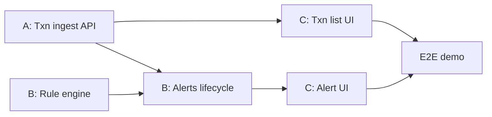

# Team Work Split — Transaction Monitoring & Alerts

**Team size:** 3  
**Names:** fill in below (replace the placeholders)  
**Source of truth for status:** [`Project_milestones.md`](../Project_milestones.md)  
**Conventions:** [`AGENTS.md`](../AGENTS.md), [`.cursor/rules/`](../.cursor/rules/)

| Role | Name | Primary ownership |
|------|------|-------------------|
| **Person A** — Transactions & API | *\<Name 1\>* | `transaction` module, public ingest/simulate API, source filters, Swagger, seed script |
| **Person B** — Rules & Alerts | *\<Name 2\>* | `rule` module, `alert` module, wiring eval → alert creation |
| **Person C** — Frontend & Demo | *\<Name 3\>* | `frontend/` (bluish UI), typed API clients, source/KPI columns, E2E demo |

Shared for everyone: `common` (exceptions, shared config), schema decisions in
[`DATABASE_DESIGN.md`](./DATABASE_DESIGN.md), updating milestones when a
checkbox is done.

---

## Why this split

The backend is a **modular monolith** with clear packages
(`api`, `transaction`, `rule`, `alert`, `common`). Soft multi-source
tenancy: banks and merchants share one DB; rows carry `source_type`,
`source_id`, `source_name`.

The rule engine is the piece designed to extract later — keep it behind
`Rule` / `RuleEngine` so Person B owns that boundary.

Frontend must not invent endpoints ahead of the backend
([`frontend-react.mdc`](../.cursor/rules/frontend-react.mdc)).

---

## Phase 1 — MVP (current)

Skeleton is **done**. Remaining work:

### Person A — Transactions & API

| Milestone item | Notes |
|----------------|--------|
| Transaction entity + repository | Enriched fields per DB design (incl. `source_*`, location, `payee_name`) |
| `POST /transactions`, `GET /transactions` | Same contract for bank/merchant **simulators**; filter by source/account |
| Swagger / OpenAPI | Once transaction (and later alert) endpoints exist |
| Seed / simulate script | Hits ingest for sample BANK and MERCHANT sources |
| Basic KPI aggregations API | Counts by source / open alerts if exposed as endpoint |

**Owns packages:** `transaction`, transaction-related types under `api`  
**Does not own:** rule evaluation logic, alert lifecycle UI

**Hand-off contract for B:**  
`TransactionService.record(...)` persists a transaction and exposes a
hook/call site where B will invoke `RuleEngine.evaluate(...)`.

### Person B — Rules & Alerts

| Milestone item | Notes |
|----------------|--------|
| Rule engine skeleton | `Rule`, `RuleEngine`, `AmountThresholdRule` (hardcoded — Phase 1) |
| Wire recording → sync evaluation | MTTD path: same request; no queue yet |
| Alert entity + repository + `alert_transactions` | Denormalize `source_*` + `account_id` on alerts |
| Alert lifecycle endpoints | acknowledge / investigate / close / dismiss |
| `GET /alerts`, `GET /alerts/{id}` | Include triggering transactions; filter by source |

**Owns packages:** `rule`, `alert`, alert-related types under `api`  
**TDD focus:** rule trigger/non-trigger/boundary; every lifecycle transition

### Person C — Frontend & Demo

| Milestone item | Notes |
|----------------|--------|
| Bluish operator UI theme | Product preference for Phase 1 look |
| React: transaction list | Filter/search by source; show `sourceName` |
| React: alert list + detail + lifecycle | After B’s APIs exist |
| Basic KPI strip | Txn counts / open alerts |
| End-to-end MVP demo | Simulate bank/merchant over-threshold → alert → close |

**Owns:** `frontend/`  
**Screen order:** transaction list → active alerts → alert detail →
lifecycle actions → (later) history / rules view

**While blocked on APIs:** layout shell, bluish styling, routing, empty
states — **not** fake backend contracts.

---

## Recommended sequencing

```text
1. A: Transaction entity + repo + POST/GET (with source fields)
2. B: Rule + AmountThreshold (unit-tested) in parallel with (1)
3. B: Alert entity + create path; A/B: wire POST → evaluate → create alert
4. B: Alert lifecycle + GET alerts
5. C: Transaction list + source filters as soon as GET works
6. C: Alert UI + KPI strip as APIs land
7. A: Swagger + BANK/MERCHANT seed script
8. All three: E2E demo dry-run together
```



---

## Phase 2 — Extra rules + user-configurable rules

| Person | Owns |
|--------|------|
| **B** | `VelocityRule`, `NewPayeeRule`, `DailyLimitRule`; rules table/params; extra team custom rules |
| **A** | Repo helpers rules need; keep source filters solid |
| **C** | Severity colors; rules management UI (view first; edit thresholds) |

Do **not** start Phase 2 until Phase 1 E2E demo works.

---

## Phase 3 — Scale-out

| Person | Owns |
|--------|------|
| **B** | Queue; extract rule engine; workers; cache for count/sum lookups |
| **A** | Stable `POST /internal/alerts`; read-replica for KPI queries |
| **C** | UI unchanged vs sync/async internals |

---

## Phase 4 — Security & hardening

| Person | Owns |
|--------|------|
| **A** | TLS, credentials out of source, DB encryption at rest |
| **B** | Audit trail for alert status changes |
| **C** | Mask sensitive fields in UI; HTTPS; no secrets in frontend |

---

## Collaboration rules

1. **One package owner** for primary PRs.
2. **TDD** for rules and alert transitions.
3. **Plans** for non-trivial work → [`.cursor/plans/`](../.cursor/plans/).
4. **Update** [`Project_milestones.md`](../Project_milestones.md) when you finish a checkbox.
5. **Schema:** soft tenancy; denormalized `source_*` / `account_id` /
   `payee_id`; no Account/Payee/Source master tables in MVP
   ([`DATABASE_DESIGN.md`](./DATABASE_DESIGN.md)).
6. Prefer **small PRs** that match milestone checkboxes.

---

## Out of scope

- Machine learning / anomaly detection  
- Authentication / multi-operator support  
- Hard tenancy or live bank network integrations  

---

## Checklist

- [ ] Replace *\<Name 1/2/3\>* with real names  
- [ ] Agree branch naming (e.g. `feat/A-transactions`, `feat/B-alerts`, `feat/C-ui`)  
- [ ] Agree DTO / OpenAPI field names (`sourceType`, `sourceId`, `sourceName`)  
- [ ] Sync after A’s first `GET /transactions` and B’s first alert create  

*Last updated: 04 August 2026*
